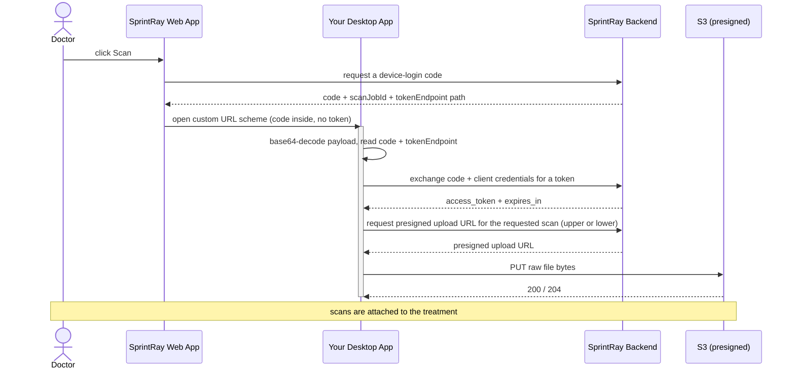

# SprintRay Desktop Scanner Integration — Example App

English | [中文](./README.zh-CN.md)

A reference implementation and **example of the desktop-app side** of SprintRay's
device-login + scan-upload integration. Use it to understand the flow and to test your integration
end to end before building it into your real desktop scanner app.

It ships two front ends over **one shared, fully-instrumented flow** (`src/core/`):

- a **desktop UI (Electron)** — `npm run app` — that shows the decoded launch payload, a live
  pipeline of every step, and **every HTTP request and its full response** on the wire, so a tester
  can watch the whole data flow (see [Desktop UI](#desktop-ui-electron));
- a **command-line runner** — `npm start` — same flow, logged to the console.

The CLI and its core are **zero-dependency** (Node.js ≥ 18 built-ins only). Electron is an optional
`devDependency`, pulled in only for the UI.

## How the integration works

From your desktop app's point of view, there are four steps — **no browser, no re-login, and no
token ever travels in the launch URL**:

1. **Launch.** From a treatment page, the SprintRay web app opens your app through its custom URL
   scheme with a base64-encoded JSON payload — `yourscheme://<base64_json>` — carrying a **one-time,
   short-lived `code`**.
2. **Decode.** Base64-decode the payload and read the `code`, the token-endpoint path, and the
   treatment/case identifiers (see [Launch payload](#launch-payload)).
3. **Exchange.** POST the `code` + your client credentials over HTTPS to obtain the signed-in
   doctor's `access_token`.
4. **Upload.** Request a presigned upload URL for the requested scan (the launch payload's
   `fileType` — one file per launch), then PUT the file bytes to it. The scan attaches to the
   treatment automatically.

### Flow



### Launch payload

```json
{
  "caller": { "name": "SprintRay", "version": "1.0.10.0" },
  "case": { "name": "<patient name>", "ID": "<scan-job id>" },
  "treatment": {
    "teeth": [
      { "teeth": 3, "notes": "", "toothApplianceType": 3, "groupNumber": null }
    ]
  },
  "fileType": null,
  "language": "en_US",
  "serverType": 0,
  "toothSystem": "fdi",
  "auth": {
    "code": "<one-time-code>",
    "tokenEndpoint": "/api/integration/device-login-token",
    "expiresIn": 600
  },
  "treatmentId": "<treatment id>",
  "externalCaseId": "<external case id>"
}
```

| Field | Use |
|---|---|
| `caller` | who launched the app (`SprintRay` + web app version) |
| `case.name` | patient display name |
| `case.ID` | scan-job identifier for this launch |
| `treatment.teeth[]` | selected teeth — `teeth` (tooth number), `notes`, `toothApplianceType`, `groupNumber` |
| `fileType` | requested file type (`TreatmentFiles`; see [Enums](#enums)), or `null` for a full scan |
| `language` | UI locale, e.g. `en_US` |
| `serverType` | server type indicator |
| `toothSystem` | tooth numbering: `fdi` or `utn` |
| `auth.code` | one-time device-login code to exchange |
| `auth.tokenEndpoint` | token endpoint **path** — join onto the backend origin |
| `auth.expiresIn` | code lifetime, seconds |
| `treatmentId` | treatment the uploaded scans attach to |
| `externalCaseId` | external case id (send back as `externalCaseId` on upload) |

> The `auth`, `treatmentId` and `externalCaseId` fields are the SprintRay
> silent-auth + upload context; the rest is the standard ScanPro launch payload.

## API contract

Two calls. `{ORIGIN}` is the fixed SprintRay backend origin for your environment (no `/api`
suffix; the paths already include it):

| Environment | `{ORIGIN}` |
|---|---|
| production | `https://dashboard.sprintray.com` |

SprintRay provides the origin for your target environment.

### 1. Exchange the code for a token

```http
POST {ORIGIN}{auth.tokenEndpoint}
Content-Type: application/json

{ "code": "<code>", "clientId": "<your-client-id>", "clientSecret": "<your-client-secret>" }
```

`200 → { "access_token": "…", "token_type": "Bearer", "expires_in": 86400 }`

Errors: `400` code missing/expired/already used · `401` bad client credentials.
When the token expires, re-launch to obtain a new one.

### 2. Get a presigned upload URL, then PUT the file

```http
POST {ORIGIN}/api/file/upload
Authorization: Bearer <access_token>
Content-Type: application/json

{ "fileName": "upper.stl", "fileSize": 3083734, "treatmentId": "<treatment-id>",
  "treatmentFileType": 1, "externalCaseId": "<external-case-id>" }
```

`200 →` a presigned upload URL (a JSON string, or `{ "url": "…" }`)

```http
PUT <presignedUrl>
Content-Type: application/octet-stream
Content-Length: <fileSize>

<raw file bytes>
```

`200`/`204` on success. **No** auth header on the PUT — the presigned URL is self-authorizing.

- `treatmentFileType`: **`1` = upper jaw, `2` = lower jaw**. The example app uploads **one file
  per launch**, chosen by the launch payload's `fileType`: `2` → `lower.stl`, anything else
  (or no `fileType`) → `upper.stl`. The value and its source are logged for the upload.
- Scan files are **STL**.

## Enums

Numeric enum values referenced by the payload and the upload call.

### `treatmentFileType` / `fileType` — `TreatmentFiles`

Sent as `treatmentFileType` on upload and received as `fileType` in the launch payload. For
intra-oral scanning you only need:

| Value | Name |
|---|---|
| `1` | UpperJaw |
| `2` | LowerJaw |

<details>
<summary>All <code>TreatmentFiles</code> values</summary>

| Value | Name |
|---|---|
| 1 | UpperJaw |
| 2 | LowerJaw |
| 3 | LeftSide |
| 4 | RightSide |
| 5 | Other |
| 6 | Spr |
| 7 | SingleStl |
| 8 | DesignPhoto |
| 9 | CBCT |
| 10 | SingleStlWithSupports |
| 11 | BaseStl |
| 12 | BaseSpr |
| 13 | PonticStl |
| 14 | PonticSpr |
| 15 | PatientPhoto |
| 16 | SurgicalGuideStl |
| 17 | SurgicalGuideSpr |
| 18 | CementedRestorationStl |
| 19 | CementedRestorationSpr |
| 20 | RemovableDieStl |
| 21 | RemovableDieSpr |
| 22 | CustomBleachingTrayStl |
| 23 | CustomBleachingTraySpr |
| 24 | WaxUpUpperStl |
| 25 | TrialSmileUpperStl |
| 26 | WaxUpSpr |
| 27 | TrialSmileSpr |
| 28 | DesignVideo |
| 29 | MonolithicTryInDentureStl |
| 30 | MonolithicTryInDentureSpr |
| 31 | DentureGumBaseStl |
| 32 | DentureGumBaseSpr |
| 33 | DentureTeethStl |
| 34 | DentureTeethSpr |
| 35 | WaxUpLowerStl |
| 36 | TrialSmileLowerStl |
| 37 | CephXRayPhoto |
| 38 | PanoXRayPhoto |
| 39 | FrontFace |
| 40 | FrontSmile |
| 41 | RightSideFace |
| 42 | LeftSideFace |
| 43 | FrontTeeth |
| 44 | RightSideTeeth |
| 45 | LeftSideTeeth |
| 46 | UpperJawImage |
| 47 | LowerJawImage |
| 48 | PreppedToothIntraoralScans |
| 49 | DentureWaxSetup |
| 50 | UpperTissueScan |
| 51 | LowerTissueScan |
| 52 | PhotogrammetryData |
| 53 | MonolithicHybridDenturesStl |
| 54 | MonolithicHybridDenturesSpr |
| 55 | AICrownPreviewImage |
| 56 | AICrownStl |
| 57 | AICrownDieStl |
| 58 | BiteScanCombo |
| 59 | DentureUpperStl |
| 60 | DentureLowerStl |
| 61 | SmileDesignStl |
| 63 | SmileDesignFrontSmile |
| 64 | UpperJawRetainer |
| 65 | LowerJawRetainer |
| 66 | UpperJawAligner |
| 67 | LowerJawAligner |
| 68 | SprRetainer |
| 69 | SprAligner |
| 70 | UpperAppliance |
| 71 | LowerAppliance |
| 72 | UpperAntagonist |
| 73 | LowerAntagonist |
| 74 | VeneersDesignFrontSmile |
| 75 | VeneersStl |
| 76 | VeneersSpr |
| 77 | PreppedUpperJaw |
| 78 | PreppedLowerJaw |
| 79 | DentalModelDieStl |
| 80 | Link |
| 81 | ImplantCrownStl |
| 82 | ImplantShellTempStl |
| 83 | ImplantBridgeStl |
| 84 | UpperDirectPrintAppliance |
| 85 | LowerDirectPrintAppliance |
| 86 | UpperDirectPrintTemplate |
| 87 | LowerDirectPrintTemplate |
| 88 | SingleStlOnlyView |
| 89 | UpperJawOnlyViewStl |
| 90 | LowerJawOnlyViewStl |
| 91 | TrackingLink |
| 92 | PartialDentureBaseStl |
| 93 | PartialDentureBaseSpr |
| 94 | TreatmentTeethImage |
| 95 | AISmilePreviewImage |
| 96 | AISmilePreviewVideo |
| 97 | PreOpUpperJaw |
| 98 | PreOpLowerJaw |
| 99 | CorrectedUpperJaw |
| 100 | CorrectedLowerJaw |
| 101 | Profile45Degree |
| 102 | UpperScanbodyScan |
| 103 | LowerScanbodyScan |

Value `62` is unused.

</details>

### `treatment.teeth[].toothApplianceType` — `ToothApplianceType`

| Value | Name |
|---|---|
| 1 | PonticSites |
| 2 | Clasps |
| 3 | Crown |
| 4 | SplintCrown |
| 5 | Splint |
| 6 | Inlay |
| 7 | Onlay |
| 8 | ShellTemp |
| 9 | Wings |
| 10 | Base |
| 11 | Extraction |

### `toothSystem`

A string derived from the doctor's tooth-numbering preference (`DentalNotation`):

| `toothSystem` | Meaning |
|---|---|
| `utn` | Universal Tooth Numbering (`DentalNotation.Utn` = 1) — default |
| `fdi` | FDI World Dental Federation (`DentalNotation.Fdi` = 2) |

### `serverType`

No enum is defined for this yet; it is currently always the fixed value `0`.

## What you need from SprintRay

| Value | Env var | Notes |
|---|---|---|
| Backend origin | `SCANPRO_BASE_URL` | fixed per environment (dev / staging / prod — see above); no `/api` suffix |
| Client id | `SCANPRO_CLIENT_ID` | your integration's public id |
| Client secret | `SCANPRO_CLIENT_SECRET` | keep server-side / in your app only |
| URL scheme | `SCANPRO_URL_SCHEME` | the scheme your app registers, e.g. `openScanPro` |

## Running the example app

Prerequisites: Node.js ≥ 18 (`--env-file` needs ≥ 20.6). macOS / Windows / Linux (macOS is the
tested path for scheme registration).

```sh
cp .env.example .env      # fill in origin, client id/secret, scheme
```

## Desktop UI (Electron)

The observability-focused way to test the integration. It runs the exact same flow the CLI does, but
renders it visually so you can watch each step and inspect every byte on the wire.

```sh
npm install               # pulls in Electron (a devDependency)
npm run app               # launch the desktop UI
```

The window has three parts:

- **Left — Configuration & input.** Backend origin, client id/secret, and URL scheme are prefilled
  from `.env` (editable per run). Paste a `openScanPro://<base64>` **launch URL**, or switch to
  **Manual code** to run with an explicit `code` + treatment id. Optionally pick a custom scan file
  and toggle the token-refresh step.
- **Right — Observability.**
  - **Pipeline** — the desktop-app steps in order (decode → exchange → optional refresh → presigned
    URL → S3 PUT), each showing live status and a one-line detail.
  - **Decoded launch payload** — the extracted fields (`code`, `tokenEndpoint`, `treatmentId`,
    `externalCaseId`, `fileType`) plus the full decoded JSON. **Decode payload** shows this without
    touching the network.
  - **HTTP transactions** — one expandable card per call, each with the **complete request** (method,
    URL, headers, body) and the **complete response** (status, headers, body, duration). Bodies are
    pretty-printed and copyable; the S3 PUT body is shown as `<binary N bytes>`.
  - **Log** — the same timestamped step/ok/fail/info stream the CLI prints.

**Launch from the browser.** The app registers itself as the OS handler for the URL scheme
(`app.setAsDefaultProtocolClient`), so clicking **OR Scan** in the SprintRay web app can open it
directly — the deep link lands in the launch-URL field and auto-decodes. The **Claim handler** button
(top-right) re-claims the scheme; on macOS this is reliable from a packaged build, so during
development pasting the launch URL is the sure path.

### Register the URL scheme (real OS launch)

Make the OS route `yourscheme://…` to this example app, so clicking the launch entry in the browser
starts it for real:

```sh
npm run register      # register the scheme with the OS
npm run status        # show what the scheme currently resolves to
npm run unregister    # remove it
```

- **macOS**: an app is created under `~/Applications`; the first launch asks to control Terminal
  (to show the run) — click **OK**, or `npm run register -- --headless` to log to a file instead.
  Re-run `register` after changing code or `.env`.
- **Windows / Linux**: registers a per-user handler (registry / `.desktop`).

### Run against a launch URL directly

```sh
# Form A — the deep link handed over by the browser
node --env-file=.env src/index.js "yourscheme://<base64_json>"

# Form B — an explicit code (no launch URL)
node --env-file=.env src/index.js --code <code> --base-url <origin> --treatment-id <guid>
```

Add `--demo-refresh` to also exercise the token-refresh endpoint.

### What it does

Each run exchanges the code, then uploads a single scan — `fixtures/lower.stl` when the launch
payload's `fileType` is `2` (lower jaw), otherwise `fixtures/upper.stl` — with a live progress bar.
**Every backend request and response is logged in full** (method, URL, headers, body / status,
headers, body) so you can see exactly what to send and what to expect. Swap the files in `fixtures/`
to upload your own scans.

## Exit codes

- `0` — token exchange + all uploads succeeded (or a register/status/unregister command completed)
- `1` — bad arguments, missing env, or a failed exchange/upload

## Treatment scan files by treatment type

Files a doctor uploads when **submitting** a treatment, exported from DS production
(`TreatmentType` ⨝ `TreatmentTypeFile`, `FileKind = 0` = `Original`). Active files only; the
`Not Selected` placeholder and all `Studio *` types are omitted. `Type` is the `TreatmentFiles`
enum (value + name); a blank `MaxMB` means no explicit size cap.

| TreatmentType | Title | Type (TreatmentFiles) | Required | Accept | MaxMB |
|---|---|---|---|---|---|
| AI Night Guard | Upper Scan | 1 (UpperJaw) | Yes | .stl,.ply | 1024 |
| AI Night Guard | Lower Scan | 2 (LowerJaw) | Yes | .stl,.ply | 1024 |
| AI Restorations | Upper Prepped Scan | 77 (PreppedUpperJaw) | Yes | .stl | 1024 |
| AI Restorations | Lower Prepped Scan | 78 (PreppedLowerJaw) | Yes | .stl | 1024 |
| AI Retainer | Upper Scan | 1 (UpperJaw) | No | .stl,.ply | 1024 |
| AI Retainer | Lower Scan | 2 (LowerJaw) | No | .stl,.ply | 1024 |
| AI Sports Guard | Upper Scan | 1 (UpperJaw) | Yes | .stl,.ply | 1024 |
| AI Sports Guard | Lower Scan | 2 (LowerJaw) | Yes | .stl,.ply | 1024 |
| Bleaching Tray Models | Upper Scan | 1 (UpperJaw) | Yes | .stl,.ply,.obj,.dcm | 1024 |
| Bleaching Tray Models | Supporting Images | 5 (Other) | No | .jpeg,.jpg,.png,.gif,.svg,.bmp | 100 |
| Bleaching Tray Models | Lower Scan | 2 (LowerJaw) | Yes | .stl,.ply,.obj,.dcm | 1024 |
| Bonded Restorations | Upper Scan | 77 (PreppedUpperJaw) | Yes | .stl,.ply,.obj,.dcm | 1024 |
| Bonded Restorations | Supporting Images | 5 (Other) | No | .jpeg,.jpg,.png,.gif,.svg,.bmp | 100 |
| Bonded Restorations | Upper Scan | 97 (PreOpUpperJaw) | No | .stl,.ply,.obj,.dcm | 1024 |
| Bonded Restorations | Lower Scan | 78 (PreppedLowerJaw) | Yes | .stl,.ply,.obj,.dcm | 1024 |
| Bonded Restorations | Lower Scan | 98 (PreOpLowerJaw) | No | .stl,.ply,.obj,.dcm | 1024 |
| Bonded Restorations | Bite Scans | 58 (BiteScanCombo) | No | .stl,.ply,.obj,.dcm | 1024 |
| Bracket Removal | Maxillary scan | 1 (UpperJaw) | Yes | .stl,.ply,.obj,.dcm | 1024 |
| Bracket Removal | Supporting Images | 5 (Other) | No | .jpeg,.jpg,.png,.gif,.svg,.bmp | 100 |
| Bracket Removal | Mandibular scan | 2 (LowerJaw) | Yes | .stl,.ply,.obj,.dcm | 1024 |
| Clear Aligners | Maxillary scan | 1 (UpperJaw) | Yes | .stl,.ply,.obj,.dcm | 1024 |
| Clear Aligners | PANO X-ray | 38 (PanoXRayPhoto) | Yes | .jpeg,.jpg,.png | 1024 |
| Clear Aligners | Front Face | 39 (FrontFace) | Yes | .jpeg,.jpg,.png | 1024 |
| Clear Aligners | Front Smile | 40 (FrontSmile) | Yes | .jpeg,.jpg,.png | 1024 |
| Clear Aligners | Right Side Face | 41 (RightSideFace) | Yes | .jpeg,.jpg,.png | 1024 |
| Clear Aligners | Left Side Face | 42 (LeftSideFace) | Yes | .jpeg,.jpg,.png | 1024 |
| Clear Aligners | Upper Jaw | 46 (UpperJawImage) | Yes | .jpeg,.jpg,.png | 1024 |
| Clear Aligners | Lower Jaw | 47 (LowerJawImage) | Yes | .jpeg,.jpg,.png | 1024 |
| Clear Aligners | Front Teeth | 43 (FrontTeeth) | Yes | .jpeg,.jpg,.png | 1024 |
| Clear Aligners | Right Side Teeth | 44 (RightSideTeeth) | Yes | .jpeg,.jpg,.png | 1024 |
| Clear Aligners | Left Side Teeth | 45 (LeftSideTeeth) | Yes | .jpeg,.jpg,.png | 1024 |
| Clear Aligners | Mandibular scan | 2 (LowerJaw) | Yes | .stl,.ply,.obj,.dcm | 1024 |
| Clear Aligners | CEPH X-ray | 37 (CephXRayPhoto) | No | .jpeg,.jpg,.png | 1024 |
| Clear Aligners | Bite Scan | 58 (BiteScanCombo) | No | .stl,.ply,.obj,.dcm | 1024 |
| Definitive Crown | Maxillary scan | 1 (UpperJaw) | Yes | .stl | 1024 |
| Definitive Crown | Left side | 3 (LeftSide) | No | .stl | 1024 |
| Definitive Crown | Supporting Images | 5 (Other) | No | .jpeg,.jpg,.png,.gif,.svg,.bmp | 1024 |
| Definitive Crown | Mandibular scan | 2 (LowerJaw) | Yes | .stl | 1024 |
| Definitive Crown | Right side | 4 (RightSide) | No | .stl | 1024 |
| Dental Model | Upper Scan | 1 (UpperJaw) | No | .stl,.ply,.obj,.dcm | 1024 |
| Dental Model | Lower Scan | 2 (LowerJaw) | No | .stl,.ply,.obj,.dcm | 1024 |
| Dental Model | Bite Scans | 58 (BiteScanCombo) | No | .stl,.ply,.obj,.dcm | 1024 |
| Full Dentures | Upper Scan | 1 (UpperJaw) | Yes | .stl,.zip | 300 |
| Full Dentures | Upload any additional images. | 5 (Other) | No | .jpeg,.jpg,.png,.gif,.svg,.bmp | 100 |
| Full Dentures | Upper Wax Rim Scan | 24 (WaxUpUpperStl) | Yes | .stl,.ply,.obj,.dcm | 1024 |
| Full Dentures | Lower Wax Rim Scan | 35 (WaxUpLowerStl) | Yes | .stl,.ply,.obj,.dcm | 1024 |
| Full Dentures | Lower Scan | 2 (LowerJaw) | Yes | .stl,.zip | 300 |
| Full Dentures | Upper Denture Scan | 59 (DentureUpperStl) | Yes | .stl,.ply,.obj,.dcm | 1024 |
| Full Dentures | Lower Denture Scan | 60 (DentureLowerStl) | Yes | .stl,.ply,.obj,.dcm | 1024 |
| Full Dentures | Bite Scans | 58 (BiteScanCombo) | No | .stl,.ply,.obj,.dcm | 1024 |
| Hybrid Dentures | Upper Jaw | 1 (UpperJaw) | Yes | .stl,.ply,.obj,.dcm | 1024 |
| Hybrid Dentures | Upper Tissue Scan | 50 (UpperTissueScan) | Yes | .stl,.ply,.obj,.dcm | 1024 |
| Hybrid Dentures | Patient Records or Files | 52 (PhotogrammetryData) | No | .zip | 1024 |
| Hybrid Dentures | Upper Appliance Scan | 70 (UpperAppliance) | Yes | .stl,.ply,.obj,.dcm | 1024 |
| Hybrid Dentures | Upper Antagonist | 72 (UpperAntagonist) | Yes | .stl,.ply,.obj,.dcm | 1024 |
| Hybrid Dentures | Lower Jaw | 2 (LowerJaw) | Yes | .stl,.ply,.obj,.dcm | 1024 |
| Hybrid Dentures | Lower Tissue Scan | 51 (LowerTissueScan) | Yes | .stl,.ply,.obj,.dcm | 1024 |
| Hybrid Dentures | Upload Pictures Of Patient Smiling | 15 (PatientPhoto) | No | .jpeg,.jpg,.png | 1024 |
| Hybrid Dentures | Bite Scan | 58 (BiteScanCombo) | Yes | .stl,.ply,.obj,.dcm | 1024 |
| Hybrid Dentures | Lower Appliance Scan | 71 (LowerAppliance) | Yes | .stl,.ply,.obj,.dcm | 1024 |
| Hybrid Dentures | Lower Antagonist | 73 (LowerAntagonist) | Yes | .stl,.ply,.obj,.dcm | 1024 |
| Implant Planning and Surgical Guide | Upper Scan | 1 (UpperJaw) | No | .stl,.ply,.obj,.dcm | 1024 |
| Implant Planning and Surgical Guide | Upload full .ZIP file | 9 (CBCT) | Yes | .dicom,.zip | 1024 |
| Implant Planning and Surgical Guide | Upload any additional images | 5 (Other) | No | .jpeg,.jpg,.png,.gif,.svg,.bmp | 100 |
| Implant Planning and Surgical Guide | Denture/Wax Setup Scan | 49 (DentureWaxSetup) | No | .stl,.ply,.obj,.dcm | 1024 |
| Implant Planning and Surgical Guide | Lower Scan | 2 (LowerJaw) | No | .stl,.ply,.obj,.dcm | 1024 |
| Implant Restorations | Upper Scan | 77 (PreppedUpperJaw) | Yes | .stl,.ply,.obj,.dcm | 1024 |
| Implant Restorations | Lower Scan | 78 (PreppedLowerJaw) | Yes | .stl,.ply,.obj,.dcm | 1024 |
| Implant Restorations | Bite Scans | 58 (BiteScanCombo) | No | .stl,.ply,.obj,.dcm | 1024 |
| Implant Restorations | Upper Scanbody Scan | 102 (UpperScanbodyScan) | No | .stl,.dcm,.ply,.obj | 1024 |
| Implant Restorations | Lower Scanbody Scan | 103 (LowerScanbodyScan) | No | .stl,.dcm,.ply,.obj | 1024 |
| Moment | Upper Scan | 1 (UpperJaw) | Yes | .stl,.ply,.obj,.dcm |  |
| Moment | Bite Scans | 58 (BiteScanCombo) | No | .stl,.ply,.obj,.dcm |  |
| Moment | Pictures of Patient Smiling | 74 (VeneersDesignFrontSmile) | Yes | .jpeg,.jpg,.png,.gif,.svg,.bmp |  |
| Moment | Lower Scan | 2 (LowerJaw) | Yes | .stl,.ply,.obj,.dcm |  |
| Neer Veneer | Upper Scan | 1 (UpperJaw) | Yes | .stl,.ply,.obj,.dcm | 1024 |
| Neer Veneer | Bite Scans | 58 (BiteScanCombo) | No | .stl,.ply,.obj,.dcm | 1024 |
| Neer Veneer | Pictures of Patient Smiling | 74 (VeneersDesignFrontSmile) | Yes | .jpeg,.jpg,.png,.gif,.svg,.bmp | 1024 |
| Neer Veneer | Lower Scan | 2 (LowerJaw) | Yes | .stl,.ply,.obj,.dcm | 1024 |
| Night Guard | Upper Scan | 1 (UpperJaw) | Yes | .stl,.ply,.obj,.dcm | 1024 |
| Night Guard | Bite Scans | 58 (BiteScanCombo) | No | .stl,.ply,.obj,.dcm | 1024 |
| Night Guard | Lower Scan | 2 (LowerJaw) | Yes | .stl,.ply,.obj,.dcm | 1024 |
| Overdenture | Upper Jaw | 1 (UpperJaw) | No | .stl,.ply,.obj,.dcm | 1024 |
| Overdenture | Upper Tissue Scan | 50 (UpperTissueScan) | Yes | .stl,.ply,.obj,.dcm | 1024 |
| Overdenture | Patient Records or Files | 52 (PhotogrammetryData) | No | .zip | 1024 |
| Overdenture | Upper Appliance Scan | 70 (UpperAppliance) | No | .stl,.ply,.obj,.dcm | 1024 |
| Overdenture | Lower Jaw | 2 (LowerJaw) | No | .stl,.ply,.obj,.dcm | 1024 |
| Overdenture | Lower Tissue Scan | 51 (LowerTissueScan) | Yes | .stl,.ply,.obj,.dcm | 1024 |
| Overdenture | Upload Pictures Of Patient Smiling | 15 (PatientPhoto) | No | .jpeg,.jpg,.png | 1024 |
| Overdenture | Lower Appliance Scan | 71 (LowerAppliance) | No | .stl,.ply,.obj,.dcm | 1024 |
| Partial Denture | Upper Scan | 1 (UpperJaw) | Yes | .stl,.ply,.obj,.dcm | 1024 |
| Partial Denture | Supporting Images | 5 (Other) | No | .jpeg,.jpg,.png,.gif,.svg,.bmp | 100 |
| Partial Denture | Bite Scans | 58 (BiteScanCombo) | No | .stl,.ply,.obj,.dcm |  |
| Partial Denture | Supporting Images | 94 (TreatmentTeethImage) | Yes | .jpeg,.jpg,.png,.gif,.svg,.bmp | 1 |
| Partial Denture | Lower Scan | 2 (LowerJaw) | Yes | .stl,.ply,.obj,.dcm | 1024 |
| Retainer | Upper Scan | 1 (UpperJaw) | No | .stl,.ply,.obj,.dcm | 1024 |
| Retainer | Lower Scan | 2 (LowerJaw) | No | .stl,.ply,.obj,.dcm | 1024 |
| Smile Correct (up to 7 stages) | Front Face | 39 (FrontFace) | Yes | .jpeg,.jpg,.png | 1024 |
| Smile Correct (up to 7 stages) | Bite Scans | 58 (BiteScanCombo) | No | .stl,.ply,.obj,.dcm | 1024 |
| Smile Correct (up to 7 stages) | Upper Scan | 1 (UpperJaw) | Yes | .stl,.ply,.obj,.dcm | 1024 |
| Smile Correct (up to 7 stages) | Panorex or FMX | 38 (PanoXRayPhoto) | Yes | .jpeg,.jpg,.png | 1024 |
| Smile Correct (up to 7 stages) | Front Smile | 40 (FrontSmile) | Yes | .jpeg,.jpg,.png | 1024 |
| Smile Correct (up to 7 stages) | Lower Scan | 2 (LowerJaw) | Yes | .stl,.ply,.obj,.dcm | 1024 |
| Smile Correct (up to 7 stages) | Right Side Face | 41 (RightSideFace) | Yes | .jpeg,.jpg,.png | 1024 |
| Smile Correct (up to 7 stages) | Upper Jaw | 46 (UpperJawImage) | Yes | .jpeg,.jpg,.png | 1024 |
| Smile Correct (up to 7 stages) | Lower Jaw | 47 (LowerJawImage) | Yes | .jpeg,.jpg,.png | 1024 |
| Smile Correct (up to 7 stages) | Front Teeth | 43 (FrontTeeth) | Yes | .jpeg,.jpg,.png | 1024 |
| Smile Correct (up to 7 stages) | Right Side Teeth | 44 (RightSideTeeth) | Yes | .jpeg,.jpg,.png | 1024 |
| Smile Correct (up to 7 stages) | Left Side Teeth | 45 (LeftSideTeeth) | Yes | .jpeg,.jpg,.png | 1024 |
| Smile Design | Upper Scan | 1 (UpperJaw) | Yes | .stl,.ply,.obj,.dcm | 1024 |
| Smile Design | Bite Scans | 58 (BiteScanCombo) | No | .stl,.ply,.obj,.dcm | 1024 |
| Smile Design | Pictures of Patient Smiling | 63 (SmileDesignFrontSmile) | No | .jpeg,.jpg,.png,.gif,.svg,.bmp | 1024 |
| Smile Design | Lower Scan | 2 (LowerJaw) | Yes | .stl,.ply,.obj,.dcm | 1024 |
| Sports Guard | Upper Scan | 1 (UpperJaw) | Yes | .stl,.ply,.obj,.dcm | 1024 |
| Sports Guard | Lower Scan | 2 (LowerJaw) | Yes | .stl,.ply,.obj,.dcm | 1024 |
| Sports Guard | Bite Scans | 58 (BiteScanCombo) | No | .stl,.ply,.obj,.dcm | 1024 |
| Surgical Guide with Restoration | Upper Scan | 1 (UpperJaw) | Yes | .stl,.ply,.obj,.dcm | 1024 |
| Surgical Guide with Restoration | Upload full .ZIP file | 9 (CBCT) | Yes | .dicom,.zip | 1024 |
| Surgical Guide with Restoration | Upload any additional images | 5 (Other) | No | .jpeg,.jpg,.png,.gif,.svg,.bmp | 100 |
| Surgical Guide with Restoration | Denture/Wax Setup Scan | 49 (DentureWaxSetup) | No | .stl,.ply,.obj,.dcm | 1024 |
| Surgical Guide with Restoration | Lower Scan | 2 (LowerJaw) | Yes | .stl,.ply,.obj,.dcm | 1024 |
| Trial Smile | Upper Scan | 1 (UpperJaw) | Yes | .stl,.ply | 1024 |
| Trial Smile | Lower Scan | 2 (LowerJaw) | Yes | .stl,.ply | 1024 |
| Trial Smile | Bite Scan | 58 (BiteScanCombo) | No | .stl,.ply | 1024 |
| Trial Smile | Frontal | 40 (FrontSmile) | Yes | .jpg,.jpeg,.png,.bmp,.webp | 1024 |
| Trial Smile | Profile 45 Degree | 101 (Profile45Degree) | Yes | .jpg,.jpeg,.png,.bmp,.webp | 1024 |
| Trial Smile | Left Side | 42 (LeftSideFace) | Yes | .jpg,.jpeg,.png,.bmp,.webp | 1024 |
| Trial Smile | Right Side | 41 (RightSideFace) | Yes | .jpg,.jpeg,.png,.bmp,.webp | 1024 |
| Veneers | Upper Scan | 1 (UpperJaw) | Yes | .stl,.ply,.obj,.dcm | 1024 |
| Veneers | Bite Scans | 58 (BiteScanCombo) | No | .stl,.ply,.obj,.dcm | 1024 |
| Veneers | Pictures of Patient Smiling | 74 (VeneersDesignFrontSmile) | Yes | .jpeg,.jpg,.png,.gif,.svg,.bmp | 1024 |
| Veneers | Lower Scan | 2 (LowerJaw) | Yes | .stl,.ply,.obj,.dcm | 1024 |
