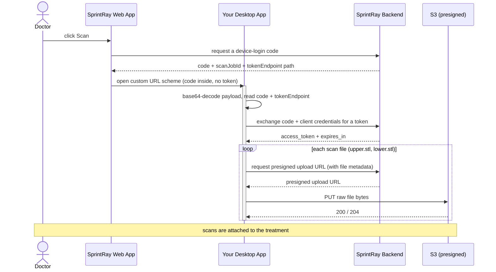

# SprintRay Desktop Scanner Integration — Example App

English | [中文](./README.zh-CN.md)

A reference implementation and command-line **example of the desktop-app side** of SprintRay's
device-login + scan-upload integration. Use it to understand the flow and to test your integration
end to end before building it into your real desktop scanner app.

Zero dependencies — Node.js ≥ 18 built-ins only.

## How the integration works

From your desktop app's point of view, there are four steps — **no browser, no re-login, and no
token ever travels in the launch URL**:

1. **Launch.** From a treatment page, the SprintRay web app opens your app through its custom URL
   scheme with a base64-encoded JSON payload — `yourscheme://<base64_json>` — carrying a **one-time,
   short-lived `code`**.
2. **Decode.** Base64-decode the payload and read the `code`, the token-endpoint path, and the
   treatment/case identifiers (see [Launch payload](#launch-payload)).
3. **Exchange.** POST the `code` + your client credentials over HTTPS to obtain the signed-in
   doctor's `access_token`.
4. **Upload.** For each scan file, request a presigned upload URL, then PUT the file bytes to it.
   The scans attach to the treatment automatically.

### Flow



### Launch payload

```json
{
  "caller": { "name": "SprintRay", "version": "1.0.10.0" },
  "case": { "name": "<patient name>", "ID": "<scan-job id>" },
  "treatment": {
    "teeth": [
      { "teeth": 3, "notes": "", "toothApplianceType": 3, "groupNumber": null }
    ]
  },
  "fileType": null,
  "language": "en_US",
  "serverType": 0,
  "toothSystem": "fdi",
  "auth": {
    "code": "<one-time-code>",
    "tokenEndpoint": "/api/integration/device-login-token",
    "expiresIn": 600
  },
  "treatmentId": "<treatment id>",
  "externalCaseId": "<external case id>",
  "supportedFileTypes": [1, 2]
}
```

| Field | Use |
|---|---|
| `caller` | who launched the app (`SprintRay` + web app version) |
| `case.name` | patient display name |
| `case.ID` | scan-job identifier for this launch |
| `treatment.teeth[]` | selected teeth — `teeth` (tooth number), `notes`, `toothApplianceType`, `groupNumber` |
| `fileType` | requested file type (`TreatmentFiles`; see [Enums](#enums)), or `null` for a full scan |
| `language` | UI locale, e.g. `en_US` |
| `serverType` | server type indicator |
| `toothSystem` | tooth numbering: `fdi` or `utn` |
| `auth.code` | one-time device-login code to exchange |
| `auth.tokenEndpoint` | token endpoint **path** — join onto the backend origin |
| `auth.expiresIn` | code lifetime, seconds |
| `treatmentId` | treatment the uploaded scans attach to |
| `externalCaseId` | external case id (send back as `externalCaseId` on upload) |
| `supportedFileTypes` | jaws offered — `1` = upper, `2` = lower |

> The `auth`, `treatmentId`, `externalCaseId` and `supportedFileTypes` fields are the SprintRay
> silent-auth + upload context; the rest is the standard ScanPro launch payload.

## API contract

Two calls. `{ORIGIN}` is the fixed SprintRay backend origin for your environment (no `/api`
suffix; the paths already include it):

| Environment | `{ORIGIN}` |
|---|---|
| dev | `https://dashboard.sprintray.com` |
| staging | `https://dashboard.sprintray.com` |
| prod | `https://dashboard.sprintray.com` |

### 1. Exchange the code for a token

```http
POST {ORIGIN}{auth.tokenEndpoint}
Content-Type: application/json

{ "code": "<code>", "clientId": "<your-client-id>", "clientSecret": "<your-client-secret>" }
```

`200 → { "access_token": "…", "token_type": "Bearer", "expires_in": 86400 }`

Errors: `400` code missing/expired/already used · `401` bad client credentials.
When the token expires, re-launch to obtain a new one.

### 2. Get a presigned upload URL, then PUT the file

```http
POST {ORIGIN}/api/file/upload
Authorization: Bearer <access_token>
Content-Type: application/json

{ "fileName": "upper.stl", "fileSize": 3083734, "treatmentId": "<treatment-id>",
  "treatmentFileType": 1, "externalCaseId": "<external-case-id>" }
```

`200 →` a presigned upload URL (a JSON string, or `{ "url": "…" }`)

```http
PUT <presignedUrl>
Content-Type: application/octet-stream
Content-Length: <fileSize>

<raw file bytes>
```

`200`/`204` on success. **No** auth header on the PUT — the presigned URL is self-authorizing.

- `treatmentFileType`: **`1` = upper jaw, `2` = lower jaw**
- Scan files are **STL**.

## Enums

Numeric enum values referenced by the payload and the upload call.

### `treatmentFileType` / `fileType` — `TreatmentFiles`

Sent as `treatmentFileType` on upload and received as `fileType` in the launch payload. For
intra-oral scanning you only need:

| Value | Name |
|---|---|
| `1` | UpperJaw |
| `2` | LowerJaw |

<details>
<summary>All <code>TreatmentFiles</code> values</summary>

| Value | Name |
|---|---|
| 1 | UpperJaw |
| 2 | LowerJaw |
| 3 | LeftSide |
| 4 | RightSide |
| 5 | Other |
| 6 | Spr |
| 7 | SingleStl |
| 8 | DesignPhoto |
| 9 | CBCT |
| 10 | SingleStlWithSupports |
| 11 | BaseStl |
| 12 | BaseSpr |
| 13 | PonticStl |
| 14 | PonticSpr |
| 15 | PatientPhoto |
| 16 | SurgicalGuideStl |
| 17 | SurgicalGuideSpr |
| 18 | CementedRestorationStl |
| 19 | CementedRestorationSpr |
| 20 | RemovableDieStl |
| 21 | RemovableDieSpr |
| 22 | CustomBleachingTrayStl |
| 23 | CustomBleachingTraySpr |
| 24 | WaxUpUpperStl |
| 25 | TrialSmileUpperStl |
| 26 | WaxUpSpr |
| 27 | TrialSmileSpr |
| 28 | DesignVideo |
| 29 | MonolithicTryInDentureStl |
| 30 | MonolithicTryInDentureSpr |
| 31 | DentureGumBaseStl |
| 32 | DentureGumBaseSpr |
| 33 | DentureTeethStl |
| 34 | DentureTeethSpr |
| 35 | WaxUpLowerStl |
| 36 | TrialSmileLowerStl |
| 37 | CephXRayPhoto |
| 38 | PanoXRayPhoto |
| 39 | FrontFace |
| 40 | FrontSmile |
| 41 | RightSideFace |
| 42 | LeftSideFace |
| 43 | FrontTeeth |
| 44 | RightSideTeeth |
| 45 | LeftSideTeeth |
| 46 | UpperJawImage |
| 47 | LowerJawImage |
| 48 | PreppedToothIntraoralScans |
| 49 | DentureWaxSetup |
| 50 | UpperTissueScan |
| 51 | LowerTissueScan |
| 52 | PhotogrammetryData |
| 53 | MonolithicHybridDenturesStl |
| 54 | MonolithicHybridDenturesSpr |
| 55 | AICrownPreviewImage |
| 56 | AICrownStl |
| 57 | AICrownDieStl |
| 58 | BiteScanCombo |
| 59 | DentureUpperStl |
| 60 | DentureLowerStl |
| 61 | SmileDesignStl |
| 63 | SmileDesignFrontSmile |
| 64 | UpperJawRetainer |
| 65 | LowerJawRetainer |
| 66 | UpperJawAligner |
| 67 | LowerJawAligner |
| 68 | SprRetainer |
| 69 | SprAligner |
| 70 | UpperAppliance |
| 71 | LowerAppliance |
| 72 | UpperAntagonist |
| 73 | LowerAntagonist |
| 74 | VeneersDesignFrontSmile |
| 75 | VeneersStl |
| 76 | VeneersSpr |
| 77 | PreppedUpperJaw |
| 78 | PreppedLowerJaw |
| 79 | DentalModelDieStl |
| 80 | Link |
| 81 | ImplantCrownStl |
| 82 | ImplantShellTempStl |
| 83 | ImplantBridgeStl |
| 84 | UpperDirectPrintAppliance |
| 85 | LowerDirectPrintAppliance |
| 86 | UpperDirectPrintTemplate |
| 87 | LowerDirectPrintTemplate |
| 88 | SingleStlOnlyView |
| 89 | UpperJawOnlyViewStl |
| 90 | LowerJawOnlyViewStl |
| 91 | TrackingLink |
| 92 | PartialDentureBaseStl |
| 93 | PartialDentureBaseSpr |
| 94 | TreatmentTeethImage |
| 95 | AISmilePreviewImage |
| 96 | AISmilePreviewVideo |
| 97 | PreOpUpperJaw |
| 98 | PreOpLowerJaw |
| 99 | CorrectedUpperJaw |
| 100 | CorrectedLowerJaw |
| 101 | Profile45Degree |
| 102 | UpperScanbodyScan |
| 103 | LowerScanbodyScan |

Value `62` is unused.

</details>

### `treatment.teeth[].toothApplianceType` — `ToothApplianceType`

| Value | Name |
|---|---|
| 1 | PonticSites |
| 2 | Clasps |
| 3 | Crown |
| 4 | SplintCrown |
| 5 | Splint |
| 6 | Inlay |
| 7 | Onlay |
| 8 | ShellTemp |
| 9 | Wings |
| 10 | Base |
| 11 | Extraction |

### `toothSystem`

A string derived from the doctor's tooth-numbering preference (`DentalNotation`):

| `toothSystem` | Meaning |
|---|---|
| `utn` | Universal Tooth Numbering (`DentalNotation.Utn` = 1) — default |
| `fdi` | FDI World Dental Federation (`DentalNotation.Fdi` = 2) |

### `serverType`

No enum is defined for this yet; it is currently always the fixed value `0`.

## What you need from SprintRay

| Value | Env var | Notes |
|---|---|---|
| Backend origin | `SCANPRO_BASE_URL` | fixed per environment (dev / staging / prod — see above); no `/api` suffix |
| Client id | `SCANPRO_CLIENT_ID` | your integration's public id |
| Client secret | `SCANPRO_CLIENT_SECRET` | keep server-side / in your app only |
| URL scheme | `SCANPRO_URL_SCHEME` | the scheme your app registers, e.g. `openScanPro` |

## Running the example app

Prerequisites: Node.js ≥ 18 (`--env-file` needs ≥ 20.6). macOS / Windows / Linux (macOS is the
tested path for scheme registration).

```sh
cp .env.example .env      # fill in origin, client id/secret, scheme
```

### Register the URL scheme (real OS launch)

Make the OS route `yourscheme://…` to this example app, so clicking the launch entry in the browser
starts it for real:

```sh
npm run register      # register the scheme with the OS
npm run status        # show what the scheme currently resolves to
npm run unregister    # remove it
```

- **macOS**: an app is created under `~/Applications`; the first launch asks to control Terminal
  (to show the run) — click **OK**, or `npm run register -- --headless` to log to a file instead.
  Re-run `register` after changing code or `.env`.
- **Windows / Linux**: registers a per-user handler (registry / `.desktop`).

### Run against a launch URL directly

```sh
# Form A — the deep link handed over by the browser
node --env-file=.env src/index.js "yourscheme://<base64_json>"

# Form B — an explicit code (no launch URL)
node --env-file=.env src/index.js --code <code> --base-url <origin> --treatment-id <guid>
```

Add `--demo-refresh` to also exercise the token-refresh endpoint.

### What it does

Each run exchanges the code, then uploads `fixtures/upper.stl` and `fixtures/lower.stl` with a live
progress bar. **Every backend request and response is logged in full** (method, URL, headers, body /
status, headers, body) so you can see exactly what to send and what to expect. Swap the two files in
`fixtures/` to upload your own scans.

## Exit codes

- `0` — token exchange + all uploads succeeded (or a register/status/unregister command completed)
- `1` — bad arguments, missing env, or a failed exchange/upload
