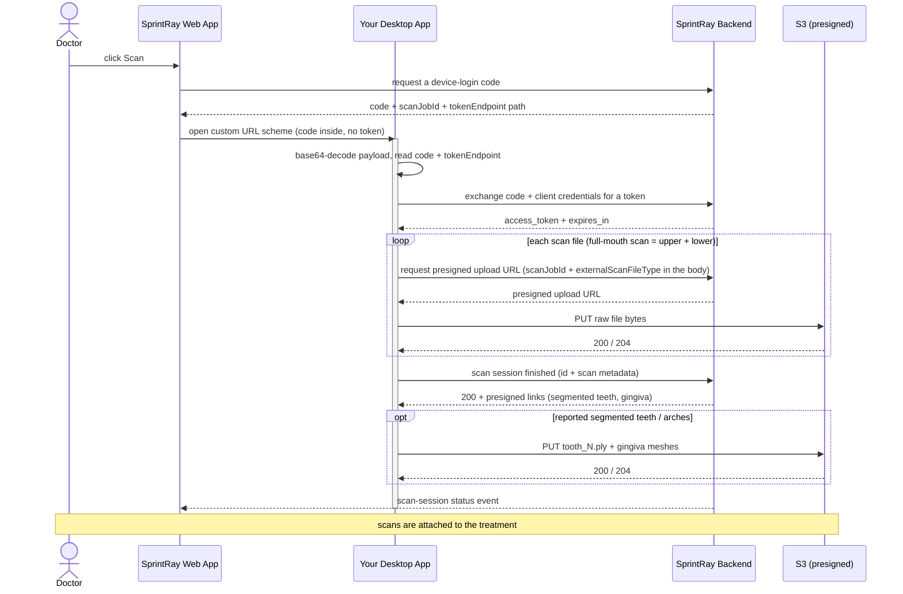

# SprintRay Desktop Scanner Integration — Example App

English | [中文](./README.zh-CN.md)

https://github.com/user-attachments/assets/80a45043-70d4-439b-bcf5-5d6698d452ce

**The whole round trip** (53 s, no audio) — the doctor starts the scan from the web app, this app
takes over and scans upper arch, lower arch and bite, really sends the case, then steps aside so the
browser is back in front with the arches uploaded. Scan processing and the upload are sped up;
everything else runs at real speed. The same file is in the repo, for reading this offline:
[`docs/demo-mode.mp4`](./docs/demo-mode.mp4).

A reference implementation and **example of the desktop-app side** of SprintRay's
device-login + scan-upload integration. Use it to understand the flow and to test your integration
end to end before building it into your real desktop scanner app.

It ships two front ends over **one shared, fully-instrumented flow** (`src/core/`):

- a **desktop UI (Electron)** — `npm run app` — with two skins: a **demo mode** that waits for a
  launch, plays a realistic chairside scan of that case, really sends it, and hands the screen back
  to the browser; and a **developer mode** that shows the
  decoded launch payload, a live pipeline of every step, and **every HTTP request and its full
  response** on the wire, so a tester can watch the whole data flow. Press `d` five times to switch
  (see [Desktop UI](#desktop-ui-electron));
- a **command-line runner** — `npm start` — same flow, logged to the console.

Both front ends also serve the **local HTTP service on `127.0.0.1`** — the second way the web app
can reach a desktop scanner, alongside the URL scheme (see
[Local HTTP service](#local-http-service-127001)).

The CLI and its core are **zero-dependency** (Node.js ≥ 18 built-ins only). Electron is an optional
`devDependency`, pulled in only for the UI; `electron-builder` only for packaging.

## How the integration works

From your desktop app's point of view, there are five steps — **no browser, no re-login, and no
token ever travels in the launch URL**:

1. **Launch.** From a treatment page, the SprintRay web app opens your app through its custom URL
   scheme with a base64-encoded JSON payload — `yourscheme://<base64_json>` — carrying a **one-time,
   short-lived `code`**. (The same payload can instead arrive over the
   [local HTTP service](#local-http-service-127001), if your app runs one.)
2. **Decode.** Base64-decode the payload and read the `code`, the token-endpoint path, and the
   treatment/case identifiers (see [Launch payload](#launch-payload)).
3. **Exchange.** POST the `code` + your client credentials over HTTPS to obtain the signed-in
   doctor's `access_token`.
4. **Upload.** A scanner captures both arches in one session, so a full-mouth scan (the launch
   payload's `fileType` is `null`) requests a presigned upload URL for **each** file and PUTs them
   in turn; a payload naming a `fileType` uploads only that arch. Every upload names the scan type
   it carries (`externalScanFileType`). Scans attach to the treatment automatically.
5. **Finish.** Call the scan-finish endpoint once, and report along with it what the session
   captured — scan mode, missing teeth, segmented teeth, which arches. SprintRay answers with
   presigned links you PUT the segmented-tooth and gingiva meshes to. Every metadata field is
   optional: reporting nothing still closes the session out, exactly as before.

### Flow



### Launch payload

```json
{
  "caller": { "name": "SprintRay", "version": "1.0.10.0" },
  "case": { "name": "<patient name>", "ID": "<scan-job id>" },
  "treatment": {
    "teeth": [
      { "teeth": 3, "notes": "", "toothApplianceType": 3, "groupNumber": null }
    ]
  },
  "fileType": null,
  "language": "en_US",
  "serverType": 0,
  "toothSystem": "fdi",
  "auth": {
    "code": "<one-time-code>",
    "tokenEndpoint": "/integration/device-login-token",
    "expiresIn": 600
  },
  "treatmentId": "<treatment id>",
  "externalCaseId": "<external case id>"
}
```

| Field | Use |
|---|---|
| `caller` | who launched the app (`SprintRay` + web app version) |
| `case.name` | patient display name |
| `case.ID` | **the scan session of this launch.** Send it back as `scanJobId` on every upload and on the scan-finish call |
| `treatment.teeth[]` | selected teeth — `teeth` (tooth number), `notes`, `toothApplianceType`, `groupNumber` |
| `fileType` | requested file type (`TreatmentFiles`; see [Enums](#enums)); `null` means a full-mouth scan, where both arches are uploaded |
| `language` | UI locale, e.g. `en_US` |
| `serverType` | server type indicator |
| `toothSystem` | tooth numbering: `fdi` or `utn` |
| `auth.code` | one-time device-login code to exchange |
| `auth.tokenEndpoint` | token endpoint **path** — join onto the backend origin |
| `auth.expiresIn` | code lifetime, seconds |
| `treatmentId` | treatment the uploaded scans attach to |
| `externalCaseId` | optional case reference; **null from SprintRay's web app**, which sends none. Echo it back on upload when it is there. It is not a session id — two launches can carry the same one — so `case.ID` is what identifies the session, and the only field to correlate on |

> The `auth`, `treatmentId` and `externalCaseId` fields are the SprintRay
> silent-auth + upload context; the rest is the standard ScanPro launch payload.

## API contract

Three calls. All go through the SprintRay API gateway; `{ORIGIN}` is the fixed gateway origin for
your environment:

| Environment | `{ORIGIN}` |
|---|---|
| development | `https://dev-apx.sprintray.com` |
| staging | `https://staging-apx.sprintray.com` |
| production | `https://apx.sprintray.com` |

SprintRay provides the origin for your target environment.

**Every call must carry `x-api-key`** — the gateway API key SprintRay issues for your integration
(a different thing from the client id / client secret: the API key identifies the caller and
selects its usage plan, the client credentials exchange the code for the doctor's token). Without
it the gateway rejects the request with `403` before it reaches the SprintRay backend.

> Gateway paths carry **no** `/api` prefix. Always build the token call from the launch payload's
> `auth.tokenEndpoint` instead of hardcoding a path — that field is there so SprintRay can change
> the route without a change in your app.

### 1. Exchange the code for a token

```http
POST {ORIGIN}{auth.tokenEndpoint}
x-api-key: <your-api-key>
Content-Type: application/json

{ "code": "<code>", "clientId": "<your-client-id>", "clientSecret": "<your-client-secret>" }
```

`200 → { "access_token": "…", "token_type": "Bearer", "expires_in": 86400 }`

Errors: `400` code missing/expired/already used · `401` bad client credentials · `403` missing or
invalid `x-api-key`. When the token expires, re-launch to obtain a new one.

### 2. Get a presigned upload URL, then PUT the file

```http
POST {ORIGIN}/integration/file/upload
Authorization: Bearer <access_token>
x-api-key: <your-api-key>
Content-Type: application/json

{ "fileName": "upper.stl", "fileSize": 3083734, "treatmentId": "<treatment-id>",
  "scanJobId": "<case.ID from the launch payload>",
  "treatmentFileType": 1, "arch": 1, "externalScanFileType": "UpperArch",
  "externalCaseId": "<external-case-id>" }
```

`200 →` a presigned upload URL (a JSON string, or `{ "url": "…" }`)

```http
PUT <presignedUrl>
Content-Type: application/octet-stream
Content-Length: <fileSize>

<raw file bytes>
```

`200`/`204` on success. **No** auth header on the PUT — the presigned URL is self-authorizing.

- `scanJobId`: the launch payload's `case.ID`. It names the scan session this file belongs to.
  Send it on every upload — it is what lets SprintRay track the session's progress, and it is the
  only way a launch that carries no treatment gets its uploads recorded at all. `treatmentId` keeps
  its own job of binding the file to the treatment; the two coexist.
- `externalScanFileType`: **required on every upload.** Your own name for what this file is —
  `UpperArch`, `LowerJaw`, `BiteScan`, whatever your app already calls it; you do not have to adopt
  SprintRay's numbering. A name SprintRay has not seen before is registered against your integration
  on first sight, and a SprintRay admin maps it once to the matching SprintRay file type and/or
  indication — from then on that mapping is **what decides the type** of every file uploaded under
  the name, ahead of any `treatmentFileType` you send. Until a name is mapped the file is still
  stored and still recorded against the session, it simply carries no SprintRay file type, so hand
  over [the list of names your app uses](#what-you-need-from-sprintray) during onboarding rather
  than letting the first upload introduce them. Casing is not significant when matching, but the first
  spelling SprintRay sees is the one it stores — spell it the same way every time.
- `treatmentFileType`: **`1` = upper jaw, `2` = lower jaw**. Optional, and a **fallback**: when your
  `externalScanFileType` is mapped to a SprintRay file type, that mapping decides the file's type
  and this value is not used. It answers for the case the mapping cannot — a name that is registered but
  not mapped to a file type yet — so send it while you are being onboarded; it stops affecting the
  outcome once your names are mapped.
- `arch` (optional): **`1` = upper, `2` = lower**. Which arch this file captures. Omit it for a file
  that captures no one arch — a bite scan, for instance. It is what the scan-finish metadata is
  split by, so a file with no `arch` gets no missing-teeth or segmented-teeth metadata attached.
- Scan files are **STL**.

### 3. Tell SprintRay the scan session is finished

Call this **once, after your last scan upload**. Uploading files does not say "the scan is over":
SprintRay sees one upload event per arch and cannot tell "the upper jaw arrived" from "the doctor is
done scanning". This call is what closes the session out and pushes the event the web app waits on,
so the doctor's browser can leave the scanning screen.

It is also where you **report what the session captured** — the scan mode, the missing teeth, the
segmented teeth, which arches — and where SprintRay hands back presigned links for the
segmented-tooth and gingiva meshes.

```http
POST {ORIGIN}/integration/scan-job/complete
Authorization: Bearer <access_token>
x-api-key: <your-api-key>
Content-Type: application/json

{
  "id": "<case.ID from the launch payload>",
  "scanMode": "quickScan",
  "hasUpper": true,
  "hasLower": true,
  "missingTeeth": [1, 16],
  "segmentedTeeth": [
    { "toothNumber": 8, "filename": "tooth_8.ply", "confidence": 0.97 }
  ]
}
```

`200 →` the finished session, plus one presigned PUT link per mesh you reported:

```json
{ "id": "<scan-job id>", "treatmentId": "<treatment id or null>", "caseId": "<external case id>",
  "status": 3, "externalProviderId": "scanpro",
  "files": [ { "fileType": 1, "fileGuid": "…", "status": 3 } ],
  "scanMode": "quickScan", "missingTeeth": [1, 16], "hasUpper": true, "hasLower": true,
  "segmentedTeethUploadLinks": [ { "toothNumber": 8, "url": "https://…" } ],
  "gingivaUploadLink": { "upper": "https://…", "lower": "https://…" },
  "createdDate": "2026-08-20T07:31:00Z", "modifiedDate": "2026-08-20T07:36:12Z" }
```

- `id` is the resolution key, and it is simply the launch payload's `case.ID`. `scanJobId` is the
  original name for the same field and is **still accepted**, so a shipped app needs no change; `id`
  wins if both are sent.
- `caseId` is accepted **instead** of the id only if you did not keep it, and only if you were given
  one — SprintRay's web app sends none, so `externalCaseId` is normally null. It is a weaker key
  regardless: a case id is not unique per launch, so SprintRay resolves the newest session carrying
  it. Keep `case.ID`; it is always there.
- **Every metadata field is optional.** A body of just `{ "id": "…" }` finishes the session exactly
  as it did before — report only what your scanner actually produces.
- `scanMode`: **your own vocabulary** — `quickScan`, `restorative`, whatever your app calls it, the
  same arrangement as `externalScanFileType` on the upload. A name SprintRay has not seen is
  registered against your integration on first sight; casing follows the first spelling, so keep it
  stable.
- `missingTeeth` and `segmentedTeeth[].toothNumber` are **universal tooth numbers (1-32)**, always —
  the launch payload's `toothSystem` governs display only, never this call.
- `hasUpper` / `hasLower`: whether the session captured each arch. They gate the gingiva links —
  no `hasLower`, no `gingivaUploadLink.lower`.
- `segmentedTeeth[]` declares the per-tooth meshes you are **about to** upload: the `toothNumber`,
  the `filename` you will use, and the segmentation `confidence`. One link comes back per tooth, in
  `segmentedTeethUploadLinks`.
- **Idempotent, metadata included.** A retry re-issues links pointing at the **same** objects, so a
  mesh you already PUT stays where it is; the reported metadata is overwritten, so a same-payload
  retry converges. Reporting metadata on a session that is already finished works too — submitting
  the treatment finishes the session on SprintRay's side, and that may beat your call.
- Once a session is finished it takes no further **scan** uploads. A re-scan is a new launch and a
  new session. The mesh links from this call keep working (see below).

Then PUT each mesh to its link:

```http
PUT <segmentedTeethUploadLinks[].url | gingivaUploadLink.upper | gingivaUploadLink.lower>
Content-Type: application/octet-stream
Content-Length: <fileSize>

<raw mesh bytes>
```

- Same rules as the scan PUT: **no** auth header, `200`/`204` on success. These links expire in
  **30 minutes** — call the finish endpoint again to get fresh ones for the same objects.
- The object's extension comes from the `filename` you reported (`tooth_8.ply`). A tooth reported
  without a filename, and every gingiva mesh, is named by SprintRay and defaults to **`.ply`**.
- There is **nothing to call after the PUT** — no confirm, no second finish call. These meshes are
  session metadata, not treatment files: they never attach to the treatment and never show up in the
  doctor's Cloud Drive.

Errors: `400` no id at all, a tooth number outside 1-32, the same `toothNumber` twice, or a
`filename` whose extension is not allowed · `401` expired/missing access token · `403` missing or
invalid `x-api-key` · `404` no such session, **or** it belongs to another doctor (the two are
deliberately indistinguishable).

### 4. Read a scan session back (optional)

Your app does not need this; it is here because it is the same session resource. It answers "which
arches has SprintRay got, and where does the session stand" — useful when something went wrong
mid-scan and you want to see what actually landed.

```http
GET {ORIGIN}/integration/scan-job/{scanJobId}
Authorization: Bearer <access_token>
x-api-key: <your-api-key>
```

`200 →` the same body shape as the finish call, minus the upload links — including the reported
`scanMode`, `missingTeeth`, `hasUpper` and `hasLower` (null on a session that reported none).
Errors: `401` · `403` · `404` as above.

`status` values: `1` pulled · `2` transferring · `3` done. Per-file `status`: `1` pending ·
`2` uploaded · `3` attached to the treatment. A file's `fileType` is `null` when neither source
answered: its `externalScanFileType` is not mapped to a file type, and the upload sent no
`treatmentFileType` either.

## Enums

Numeric enum values referenced by the payload and the upload call.

### `treatmentFileType` / `fileType` — `TreatmentFiles`

Sent as `treatmentFileType` on upload and received as `fileType` in the launch payload. For
intra-oral scanning you only need:

| Value | Name |
|---|---|
| `1` | UpperJaw |
| `2` | LowerJaw |

<details>
<summary>All <code>TreatmentFiles</code> values</summary>

| Value | Name |
|---|---|
| 1 | UpperJaw |
| 2 | LowerJaw |
| 3 | LeftSide |
| 4 | RightSide |
| 5 | Other |
| 6 | Spr |
| 7 | SingleStl |
| 8 | DesignPhoto |
| 9 | CBCT |
| 10 | SingleStlWithSupports |
| 11 | BaseStl |
| 12 | BaseSpr |
| 13 | PonticStl |
| 14 | PonticSpr |
| 15 | PatientPhoto |
| 16 | SurgicalGuideStl |
| 17 | SurgicalGuideSpr |
| 18 | CementedRestorationStl |
| 19 | CementedRestorationSpr |
| 20 | RemovableDieStl |
| 21 | RemovableDieSpr |
| 22 | CustomBleachingTrayStl |
| 23 | CustomBleachingTraySpr |
| 24 | WaxUpUpperStl |
| 25 | TrialSmileUpperStl |
| 26 | WaxUpSpr |
| 27 | TrialSmileSpr |
| 28 | DesignVideo |
| 29 | MonolithicTryInDentureStl |
| 30 | MonolithicTryInDentureSpr |
| 31 | DentureGumBaseStl |
| 32 | DentureGumBaseSpr |
| 33 | DentureTeethStl |
| 34 | DentureTeethSpr |
| 35 | WaxUpLowerStl |
| 36 | TrialSmileLowerStl |
| 37 | CephXRayPhoto |
| 38 | PanoXRayPhoto |
| 39 | FrontFace |
| 40 | FrontSmile |
| 41 | RightSideFace |
| 42 | LeftSideFace |
| 43 | FrontTeeth |
| 44 | RightSideTeeth |
| 45 | LeftSideTeeth |
| 46 | UpperJawImage |
| 47 | LowerJawImage |
| 48 | PreppedToothIntraoralScans |
| 49 | DentureWaxSetup |
| 50 | UpperTissueScan |
| 51 | LowerTissueScan |
| 52 | PhotogrammetryData |
| 53 | MonolithicHybridDenturesStl |
| 54 | MonolithicHybridDenturesSpr |
| 55 | AICrownPreviewImage |
| 56 | AICrownStl |
| 57 | AICrownDieStl |
| 58 | BiteScanCombo |
| 59 | DentureUpperStl |
| 60 | DentureLowerStl |
| 61 | SmileDesignStl |
| 63 | SmileDesignFrontSmile |
| 64 | UpperJawRetainer |
| 65 | LowerJawRetainer |
| 66 | UpperJawAligner |
| 67 | LowerJawAligner |
| 68 | SprRetainer |
| 69 | SprAligner |
| 70 | UpperAppliance |
| 71 | LowerAppliance |
| 72 | UpperAntagonist |
| 73 | LowerAntagonist |
| 74 | VeneersDesignFrontSmile |
| 75 | VeneersStl |
| 76 | VeneersSpr |
| 77 | PreppedUpperJaw |
| 78 | PreppedLowerJaw |
| 79 | DentalModelDieStl |
| 80 | Link |
| 81 | ImplantCrownStl |
| 82 | ImplantShellTempStl |
| 83 | ImplantBridgeStl |
| 84 | UpperDirectPrintAppliance |
| 85 | LowerDirectPrintAppliance |
| 86 | UpperDirectPrintTemplate |
| 87 | LowerDirectPrintTemplate |
| 88 | SingleStlOnlyView |
| 89 | UpperJawOnlyViewStl |
| 90 | LowerJawOnlyViewStl |
| 91 | TrackingLink |
| 92 | PartialDentureBaseStl |
| 93 | PartialDentureBaseSpr |
| 94 | TreatmentTeethImage |
| 95 | AISmilePreviewImage |
| 96 | AISmilePreviewVideo |
| 97 | PreOpUpperJaw |
| 98 | PreOpLowerJaw |
| 99 | CorrectedUpperJaw |
| 100 | CorrectedLowerJaw |
| 101 | Profile45Degree |
| 102 | UpperScanbodyScan |
| 103 | LowerScanbodyScan |

Value `62` is unused.

</details>

### `treatment.teeth[].toothApplianceType` — `ToothApplianceType`

| Value | Name |
|---|---|
| 1 | PonticSites |
| 2 | Clasps |
| 3 | Crown |
| 4 | SplintCrown |
| 5 | Splint |
| 6 | Inlay |
| 7 | Onlay |
| 8 | ShellTemp |
| 9 | Wings |
| 10 | Base |
| 11 | Extraction |

### `arch` — `ArchType`

Which arch an upload captures (`arch` on the upload call). Optional — omit it for a file that
captures no one arch, such as a bite scan.

| Value | Meaning |
|---|---|
| `1` | upper |
| `2` | lower |

### `toothSystem`

A string derived from the doctor's tooth-numbering preference (`DentalNotation`):

| `toothSystem` | Meaning |
|---|---|
| `utn` | Universal Tooth Numbering (`DentalNotation.Utn` = 1) — default |
| `fdi` | FDI World Dental Federation (`DentalNotation.Fdi` = 2) |

This governs how teeth are **displayed** to the doctor. Tooth numbers you send SprintRay —
`missingTeeth` and `segmentedTeeth[].toothNumber` on the scan-finish call — are always **universal
(1-32)**, whatever `toothSystem` says.

### `serverType`

No enum is defined for this yet; it is currently always the fixed value `0`.

## What you need from SprintRay

| Value | Env var | Notes |
|---|---|---|
| Gateway origin | `SCANPRO_BASE_URL` | fixed per environment (dev / staging / prod — see above) |
| Gateway API key | `SCANPRO_API_KEY` | sent as `x-api-key`; identifies the caller and selects its usage plan |
| Client id | `SCANPRO_CLIENT_ID` | your integration's public id |
| Client secret | `SCANPRO_CLIENT_SECRET` | keep server-side / in your app only |
| URL scheme | `SCANPRO_URL_SCHEME` | the scheme your app registers, e.g. `openScanPro` |
| Telemetry endpoint | `SCANPRO_TELEMETRY_URL` | only for the port-exhaustion event; per environment |
| Telemetry API key | `SCANPRO_TELEMETRY_API_KEY` | the only credential the telemetry endpoint takes |

Not a credential, but part of the same onboarding, and it goes the other way: `externalScanFileType`
is required on every upload, so hand SprintRay **the list of names your app uses** — those, plus the
`scanMode` names — for an admin to map each one to the matching SprintRay file type / indication.
Until a name is mapped, files uploaded under it carry no SprintRay file type.

## Running the example app

Prerequisites: Node.js ≥ 18 (`--env-file` needs ≥ 20.6). macOS / Windows / Linux (macOS is the
tested path for scheme registration).

```sh
cp .env.example .env      # fill in origin, client id/secret, scheme
```

## Desktop UI (Electron)

```sh
npm install               # pulls in Electron (a devDependency)
npm run app               # launch the desktop UI
```

The window has **two skins over the same flow**, and **pressing `d` five times** switches between
them at any time:

| Skin | For | Opens by default |
|---|---|---|
| **Demo mode** | showing what the integration looks like to a doctor | yes |
| **Developer mode** | testing the integration and reading the wire traffic | `SCANPRO_UI_MODE=dev` |

### Demo mode

This is the skin in the [walkthrough at the top](#sprintray-desktop-scanner-integration--example-app).

A stand-in for a real intra-oral scanner app: dark stage, tool rails, live camera preview, scan
quality legend. It follows **the desktop app's real lifecycle**, the same one the developer skin
runs on:

1. **Idle.** The window waits, showing which launch transports are live (the URL scheme, and the
   port the local service is listening on). Nothing scans.
2. **A launch payload arrives** — the OS URL scheme, or `POST /scanpro/v1/start` on the local
   service — and the case plays: the upper arch sweeps in under a virtual wand (the bundled STL
   arches, revealed in scan order, with holes and layering marked on the raw mesh), then the lower
   arch, then bite registration, then a refine pass that closes the holes and smooths the models.
   The patient name, case id and selected teeth come from the payload; a payload naming a
   `fileType` scans only that arch. A launch arriving mid-case restarts on the new one.
3. **Back to the browser.** Once the case is sent, the card counts down and the app steps out of
   the way — hidden on macOS, minimized on Windows — so the page the doctor started from is in
   front again. The next launch brings the window back. A failed send stays on screen instead,
   until it is dismissed.

**The send is real.** It calls the same `runFlow()` the developer skin does, so with the credentials
in `.env` set, the case really is exchanged, uploaded and closed out — the progress on the card is
actual HTTP progress, and the card names the treatment and file sizes the backend accepted. Without
credentials the card says so and the transfer is simulated.

### Developer mode

The observability-focused way to test the integration. It runs the exact same flow the CLI does, but
renders it visually so you can watch each step and inspect every byte on the wire. Its window has
three parts:

- **Left — Configuration & input.** Gateway origin, API key, client id/secret, and URL scheme are prefilled
  from `.env` (editable per run). Paste a `openScanPro://<base64>` **launch URL**, or switch to
  **Manual code** to run with an explicit `code` + treatment id. Optionally pick a custom scan file
  for the upper and lower arch separately, and toggle the token-refresh step.
- **Right — Observability.**
  - **Pipeline** — the desktop-app steps in order (decode → exchange → optional refresh → presigned
    URL → S3 PUT), each showing live status and a one-line detail.
  - **Decoded launch payload** — the extracted fields (`code`, `tokenEndpoint`, `treatmentId`,
    `externalCaseId`, `fileType`) plus the full decoded JSON. **Decode payload** shows this without
    touching the network.
  - **HTTP transactions** — one expandable card per call, each with the **complete request** (method,
    URL, headers, body) and the **complete response** (status, headers, body, duration). Bodies are
    pretty-printed and copyable; the S3 PUT body is shown as `<binary N bytes>`.
  - **Log** — the same timestamped step/ok/fail/info stream the CLI prints.

**Launch from the browser.** The app registers itself as the OS handler for the URL scheme
(`app.setAsDefaultProtocolClient`), so clicking **OR Scan** in the SprintRay web app can open it
directly — the deep link lands in the launch-URL field and auto-decodes. The **Claim handler** button
(top-right) re-claims the scheme; on macOS this is reliable from a packaged build, so during
development pasting the launch URL is the sure path.

### Register the URL scheme (real OS launch)

Make the OS route `yourscheme://…` to this example app, so clicking the launch entry in the browser
starts it for real:

```sh
npm run register      # register the scheme with the OS
npm run status        # show what the scheme currently resolves to
npm run unregister    # remove it
```

- **macOS**: an app is created under `~/Applications`; the first launch asks to control Terminal
  (to show the run) — click **OK**, or `npm run register -- --headless` to log to a file instead.
  Re-run `register` after changing code or `.env`.
- **Windows / Linux**: registers a per-user handler (registry / `.desktop`).

### Run against a launch URL directly

```sh
# Form A — the deep link handed over by the browser
node --env-file=.env src/index.js "yourscheme://<base64_json>"

# Form B — an explicit code (no launch URL)
node --env-file=.env src/index.js --code <code> --base-url <origin> --treatment-id <guid>
```

Add `--demo-refresh` to also exercise the token-refresh endpoint; `--upper-file <p>` / `--lower-file <p>`
swap the file sent for either arch.

### What it does

Each run exchanges the code, then uploads the way the scanner really does — a full-mouth scan
(`fileType` is `null`) sends `fixtures/upper.stl` and `fixtures/lower.stl` in turn, and a payload
naming an arch sends only that one — each with a live progress bar. After the last upload it makes
the scan-finish call, so the run ends the way a real session does. Form B (`--code`, no launch URL)
has no `case.ID`, so there is no session to finish and that step reports as skipped.
**Every backend request and response is logged in full** (method, URL, headers, body / status,
headers, body) so you can see exactly what to send and what to expect. Swap the files in `fixtures/`
to upload your own scans.

## Local HTTP service (`127.0.0.1`)

The **second way** the web app can reach the desktop. Instead of handing the payload to an OS URL
scheme, the browser probes a fixed port range on loopback for a resident service and posts the
payload to it. It is the same base64 JSON payload either way, and in this example app both
transports end up in the same window.

This app implements the service side of that contract, so you can point the web app at it and see
exactly what a caller sees — including the CORS behaviour, which is where browser-to-loopback
integrations usually break.

The desktop UI starts the service on launch; the **server** chip in the top-right shows the port it
took (hover for the endpoints). To run it on its own, without Electron:

```sh
npm run serve                  # bind a port; /start launches the desktop app via the URL scheme
npm run serve -- --run-flow    # /start instead exchanges the code and uploads a scan in-process
npm run serve -- --help        # all options: port range, reported version/state, host check
```

Run headlessly, `/start` launches the app the way the real resident service does — by handing the
payload to the OS handler for the URL scheme, so whatever `npm run register` or an installed build
claimed is what starts. The launch is then **confirmed**: the launcher exiting 0 only means the OS
accepted the request, and a stale handler that starts and dies immediately would otherwise pass as
success, so the response reports what actually happened:

| `errorCode` | Meaning |
|---|---|
| `NO_HANDLER_REGISTERED` | nothing claims the scheme — install a build or run `npm run register` |
| `LAUNCH_NOT_CONFIRMED` | the OS accepted the launch but no process stayed up (usually a stale handler) |
| `LAUNCH_FAILED` | the OS launcher itself reported an error |

### Discovery

There is **no fixed port** — the service takes the first one it can bind, so the caller has to
probe. Both sides must agree on the range:

| | |
|---|---|
| Port range | `29083`–`29183` inclusive (101 ports) |
| Selection | on startup, try `29083` upwards; first port that binds wins |
| Bind address | `127.0.0.1` only — never an external interface |
| Range exhausted | the service does **not** start; it reports telemetry instead (see below) |

**How a caller probes:** `GET /scanpro/v1/status` on each port from `29083` upwards. The first one
that answers `200` with `"service": "SprintRayScanService"` is this service. Cache that port and
reuse it; only probe again after a request to it fails.

> Matching on `service` matters. A response carrying only a `version` field is not enough to tell
> this service apart from any unrelated program that happens to hold the port.

### `GET /scanpro/v1/status`

Installed state, running state and version in one call — no need to probe them separately.

```console
$ curl -s http://127.0.0.1:29083/scanpro/v1/status
{"service":"SprintRayScanService","running":true,"installed":true,"version":"0.2.0"}
```

| Field | Type | Meaning |
|---|---|---|
| `service` | string | always `SprintRayScanService` — the discovery marker |
| `running` | bool | ScanPro is running |
| `installed` | bool | ScanPro is installed |
| `version` | string | ScanPro's version |

### `POST /scanpro/v1/start`

Starts ScanPro with a launch payload. **The call blocks** until the start has succeeded or failed,
so give it a generous timeout — and if you do time out, call `/status` before retrying, because
ScanPro may well be up already.

`argument` is the launch payload as **base64-encoded JSON** — the same payload the URL scheme
carries. It is required and must not be empty.

```sh
ARGUMENT=$(node -e 'console.log(Buffer.from(JSON.stringify({
  caller: { name: "SprintRay", version: "1.0.10.0" },
  case:   { name: "Jane Doe", ID: "04024e3b-ff28-4d6a-bdea-4c777e4cfb0d" },
  language: "en_US", serverType: 0, toothSystem: "fdi",
  treatment: { teeth: [{ number: "17", workType: "Crown" }] }
})).toString("base64"))')

curl -s -X POST http://127.0.0.1:29083/scanpro/v1/start \
  -H 'Content-Type: application/json' \
  -d "{\"argument\":\"$ARGUMENT\"}"
```

```json
{ "status": true, "started": true }
```

`status` is the field the contract defines; `started` is the same value under a clearer name, sent
alongside it so either reading works. A failed start adds `errorCode` and `message`.

Sending a payload that also carries SprintRay's `auth` block makes this a complete launch: in the
desktop UI the window comes forward with the payload decoded, and under `serve --run-flow` the
example app exchanges the code and uploads a scan before answering the request.

### Errors

`200` means the request was handled, **not** that the business result was positive — "ScanPro is not
installed" is a `200` with `installed: false`. Genuine errors use status codes and a fixed envelope:

```json
{ "error": { "code": "ARGUMENT_REQUIRED", "message": "`argument` is required and must be a non-empty string" } }
```

| Status | `code` | When |
|---|---|---|
| `400` | `INVALID_JSON` | the request body is not JSON |
| `400` | `ARGUMENT_REQUIRED` | `argument` missing, not a string, or empty |
| `400` | `ARGUMENT_NOT_BASE64_JSON` | `argument` does not decode to a JSON object |
| `403` | `HOST_NOT_ALLOWED` | the `Host` header is not a loopback name (see below) |
| `404` | `NOT_FOUND` | unknown path |
| `405` | `METHOD_NOT_ALLOWED` | right path, wrong method |
| `413` | `PAYLOAD_TOO_LARGE` | body over 256 KB |
| `500` | `START_ERROR` / `STATUS_ERROR` | the service itself failed |

`code` is a stable constant — branch on it, not on `message`.

### CORS and Chrome's Private Network Access

The caller is an HTTPS page reaching into `http://127.0.0.1`, which is cross-origin. Without the
right headers the browser discards the response even though the request succeeded, so the service:

- echoes the request's `Origin` in `Access-Control-Allow-Origin` and always sends `Vary: Origin`;
- answers `OPTIONS` preflights with the allowed methods and headers;
- answers a preflight carrying `Access-Control-Request-Private-Network: true` with
  `Access-Control-Allow-Private-Network: true` — **Chrome blocks the call without this**.

By default any origin is echoed, which is the easiest thing to test against. Set
`SCANPRO_LOCAL_SERVER_ORIGINS` to a comma-separated list to make it an allowlist; any other origin
then gets no `Access-Control-Allow-Origin` back and the browser blocks it.

The service is unauthenticated and relies on being reachable only over loopback. That holds only
while requests really are addressed to loopback, so a request whose `Host` header is some other
name — the shape a DNS-rebinding attack takes — is rejected with `403`. Pass `--allow-any-host` to
turn the check off while debugging a proxy.

### When every port is taken

If all 101 ports are busy the service does not start, the web app's probe finds nothing, and to the
doctor it just looks like clicking **Scan** does nothing. Nothing on the machine notices, so the
service reports it:

| | |
|---|---|
| `eventName` | `local_server.port_unavailable` |
| `severity` | `error` |
| `eventData` | `{ portRangeStart, portRangeEnd, attempted, lastErrorCode }` |

The batch reports `app.name` as `ScanPro`, carries no `userId` (the service starts before anyone
logs in, and a placeholder is worse than nothing) and no `scanner` object. It is sent only when
both `SCANPRO_TELEMETRY_URL` and `SCANPRO_TELEMETRY_API_KEY` are set; otherwise the failure is just
logged locally. `deviceId` is a SHA-256 of the OS machine id and `installationId` is generated once
and persisted, both under `~/.sprintray-scanpro-example/` (the app's user-data directory when
packaged).

### Where this goes beyond the written contract

Four additions, all backwards-compatible — a client that ignores them still works:

| Addition | Why |
|---|---|
| `service` in `/status` | `version` alone cannot identify the service during a port probe |
| `{ error: { code, message } }` on 4xx/5xx | the contract only defines success bodies; `code` is a stable constant, not localized prose |
| `started` next to `status` | `/status` uses semantic names (`running`, `installed`); `/start` returning a generic `status` reads inconsistently |
| loopback `Host` check | an unauthenticated loopback service otherwise trusts any name that resolves to `127.0.0.1` |

One deliberate difference in behaviour: a real service hands `argument` to ScanPro untouched, while
this one decodes it and answers `400` when it is not base64 JSON. That is the point of a simulator —
you find out here that the payload is malformed, instead of watching a scanner sit idle.

## Exit codes

- `0` — token exchange + all uploads succeeded (or a register/status/unregister command completed)
- `1` — bad arguments, missing env, a failed exchange/upload, or `serve` finding no free port

## Building installers

```sh
npm run dist:win     # Windows x64 → release/*.exe  (NSIS installer)
npm run dist:mac     # macOS arm64 → release/*.dmg + *.zip
```

Each platform builds on its own OS. Targets:

| Target | Arch | Output | Supported on |
|---|---|---|---|
| Windows | x64 | NSIS installer (`.exe`), per-user, no admin needed | Windows 10 1809 and newer |
| macOS | arm64 | `.dmg` and `.zip` | Apple silicon, macOS 12+ |

The packaged app registers the `openScanPro` scheme with the OS by itself and reads its `.env` from
next to the executable, falling back to the per-user data directory (the UI's Configuration panel
shows which file it found, and the fields stay editable per run).

### Signing (macOS: required, not optional)

Without a Developer ID certificate the macOS build is only **ad-hoc signed**, and on macOS 15 and
newer Gatekeeper *rejects* that. The failure gives you nothing to go on: the app starts and is
killed within a second, with no dialog and no output — so opening it from Finder, through the
`openScanPro://` scheme, or through the local service's `/start` all look like "nothing happened".
Running the binary straight from a terminal still works, which is what makes this so easy to miss:

```sh
# works even when the app cannot be launched normally
"/Applications/ScanPro Integration Example.app/Contents/MacOS/ScanPro Integration Example"

# what the OS actually thinks of the build
spctl -a -vvv -t exec "/Applications/ScanPro Integration Example.app"   # -> rejected
```

To ship a build testers can actually open, add these repository secrets and the release workflow
signs (and notarizes) automatically:

| Secret | Purpose |
|---|---|
| `MAC_CSC_LINK` | Developer ID Application certificate (`.p12`, base64-encoded) |
| `MAC_CSC_KEY_PASSWORD` | password for that `.p12` |
| `APPLE_ID`, `APPLE_APP_SPECIFIC_PASSWORD`, `APPLE_TEAM_ID` | notarization |

Without them the workflow still builds, logs a warning, and prints the resulting signature and
Gatekeeper verdict in the job output.

**Running an unsigned build anyway.** Right-click the app > **Open** once and confirm, or approve it
under **System Settings > Privacy & Security**. Clearing the quarantine attribute on its own is not
enough on current macOS:

```sh
xattr -dr com.apple.quarantine "/Applications/ScanPro Integration Example.app"
```

The Windows build is unsigned too, but there SmartScreen only warns — click **More info** >
**Run anyway**.

**Releases.** Pushing a `v*` tag builds both targets and attaches them to a GitHub Release under
that tag (`.github/workflows/release.yml`). The tag sets the version the app reports, so `v0.3.0`
produces an app whose `/status` reports `0.3.0`:

```sh
git tag v0.3.0 && git push origin v0.3.0
```

Run the workflow manually (**Actions → release → Run workflow**) to build both targets without
cutting a release — the installers come back as workflow artifacts.

## Treatment scan files by treatment type

Files a doctor uploads when **submitting** a treatment, exported from DS production
(`TreatmentType` ⨝ `TreatmentTypeFile`, `FileKind = 0` = `Original`). Active files only; the
`Not Selected` placeholder and all `Studio *` types are omitted. `Type` is the `TreatmentFiles`
enum (value + name); a blank `MaxMB` means no explicit size cap.

| TreatmentType | Title | Type (TreatmentFiles) | Required | Accept | MaxMB |
|---|---|---|---|---|---|
| AI Night Guard | Upper Scan | 1 (UpperJaw) | Yes | .stl,.ply | 1024 |
| AI Night Guard | Lower Scan | 2 (LowerJaw) | Yes | .stl,.ply | 1024 |
| AI Restorations | Upper Prepped Scan | 77 (PreppedUpperJaw) | Yes | .stl | 1024 |
| AI Restorations | Lower Prepped Scan | 78 (PreppedLowerJaw) | Yes | .stl | 1024 |
| AI Retainer | Upper Scan | 1 (UpperJaw) | No | .stl,.ply | 1024 |
| AI Retainer | Lower Scan | 2 (LowerJaw) | No | .stl,.ply | 1024 |
| AI Sports Guard | Upper Scan | 1 (UpperJaw) | Yes | .stl,.ply | 1024 |
| AI Sports Guard | Lower Scan | 2 (LowerJaw) | Yes | .stl,.ply | 1024 |
| Bleaching Tray Models | Upper Scan | 1 (UpperJaw) | Yes | .stl,.ply,.obj,.dcm | 1024 |
| Bleaching Tray Models | Supporting Images | 5 (Other) | No | .jpeg,.jpg,.png,.gif,.svg,.bmp | 100 |
| Bleaching Tray Models | Lower Scan | 2 (LowerJaw) | Yes | .stl,.ply,.obj,.dcm | 1024 |
| Bonded Restorations | Upper Scan | 77 (PreppedUpperJaw) | Yes | .stl,.ply,.obj,.dcm | 1024 |
| Bonded Restorations | Supporting Images | 5 (Other) | No | .jpeg,.jpg,.png,.gif,.svg,.bmp | 100 |
| Bonded Restorations | Upper Scan | 97 (PreOpUpperJaw) | No | .stl,.ply,.obj,.dcm | 1024 |
| Bonded Restorations | Lower Scan | 78 (PreppedLowerJaw) | Yes | .stl,.ply,.obj,.dcm | 1024 |
| Bonded Restorations | Lower Scan | 98 (PreOpLowerJaw) | No | .stl,.ply,.obj,.dcm | 1024 |
| Bonded Restorations | Bite Scans | 58 (BiteScanCombo) | No | .stl,.ply,.obj,.dcm | 1024 |
| Bracket Removal | Maxillary scan | 1 (UpperJaw) | Yes | .stl,.ply,.obj,.dcm | 1024 |
| Bracket Removal | Supporting Images | 5 (Other) | No | .jpeg,.jpg,.png,.gif,.svg,.bmp | 100 |
| Bracket Removal | Mandibular scan | 2 (LowerJaw) | Yes | .stl,.ply,.obj,.dcm | 1024 |
| Clear Aligners | Maxillary scan | 1 (UpperJaw) | Yes | .stl,.ply,.obj,.dcm | 1024 |
| Clear Aligners | PANO X-ray | 38 (PanoXRayPhoto) | Yes | .jpeg,.jpg,.png | 1024 |
| Clear Aligners | Front Face | 39 (FrontFace) | Yes | .jpeg,.jpg,.png | 1024 |
| Clear Aligners | Front Smile | 40 (FrontSmile) | Yes | .jpeg,.jpg,.png | 1024 |
| Clear Aligners | Right Side Face | 41 (RightSideFace) | Yes | .jpeg,.jpg,.png | 1024 |
| Clear Aligners | Left Side Face | 42 (LeftSideFace) | Yes | .jpeg,.jpg,.png | 1024 |
| Clear Aligners | Upper Jaw | 46 (UpperJawImage) | Yes | .jpeg,.jpg,.png | 1024 |
| Clear Aligners | Lower Jaw | 47 (LowerJawImage) | Yes | .jpeg,.jpg,.png | 1024 |
| Clear Aligners | Front Teeth | 43 (FrontTeeth) | Yes | .jpeg,.jpg,.png | 1024 |
| Clear Aligners | Right Side Teeth | 44 (RightSideTeeth) | Yes | .jpeg,.jpg,.png | 1024 |
| Clear Aligners | Left Side Teeth | 45 (LeftSideTeeth) | Yes | .jpeg,.jpg,.png | 1024 |
| Clear Aligners | Mandibular scan | 2 (LowerJaw) | Yes | .stl,.ply,.obj,.dcm | 1024 |
| Clear Aligners | CEPH X-ray | 37 (CephXRayPhoto) | No | .jpeg,.jpg,.png | 1024 |
| Clear Aligners | Bite Scan | 58 (BiteScanCombo) | No | .stl,.ply,.obj,.dcm | 1024 |
| Definitive Crown | Maxillary scan | 1 (UpperJaw) | Yes | .stl | 1024 |
| Definitive Crown | Left side | 3 (LeftSide) | No | .stl | 1024 |
| Definitive Crown | Supporting Images | 5 (Other) | No | .jpeg,.jpg,.png,.gif,.svg,.bmp | 1024 |
| Definitive Crown | Mandibular scan | 2 (LowerJaw) | Yes | .stl | 1024 |
| Definitive Crown | Right side | 4 (RightSide) | No | .stl | 1024 |
| Dental Model | Upper Scan | 1 (UpperJaw) | No | .stl,.ply,.obj,.dcm | 1024 |
| Dental Model | Lower Scan | 2 (LowerJaw) | No | .stl,.ply,.obj,.dcm | 1024 |
| Dental Model | Bite Scans | 58 (BiteScanCombo) | No | .stl,.ply,.obj,.dcm | 1024 |
| Full Dentures | Upper Scan | 1 (UpperJaw) | Yes | .stl,.zip | 300 |
| Full Dentures | Upload any additional images. | 5 (Other) | No | .jpeg,.jpg,.png,.gif,.svg,.bmp | 100 |
| Full Dentures | Upper Wax Rim Scan | 24 (WaxUpUpperStl) | Yes | .stl,.ply,.obj,.dcm | 1024 |
| Full Dentures | Lower Wax Rim Scan | 35 (WaxUpLowerStl) | Yes | .stl,.ply,.obj,.dcm | 1024 |
| Full Dentures | Lower Scan | 2 (LowerJaw) | Yes | .stl,.zip | 300 |
| Full Dentures | Upper Denture Scan | 59 (DentureUpperStl) | Yes | .stl,.ply,.obj,.dcm | 1024 |
| Full Dentures | Lower Denture Scan | 60 (DentureLowerStl) | Yes | .stl,.ply,.obj,.dcm | 1024 |
| Full Dentures | Bite Scans | 58 (BiteScanCombo) | No | .stl,.ply,.obj,.dcm | 1024 |
| Hybrid Dentures | Upper Jaw | 1 (UpperJaw) | Yes | .stl,.ply,.obj,.dcm | 1024 |
| Hybrid Dentures | Upper Tissue Scan | 50 (UpperTissueScan) | Yes | .stl,.ply,.obj,.dcm | 1024 |
| Hybrid Dentures | Patient Records or Files | 52 (PhotogrammetryData) | No | .zip | 1024 |
| Hybrid Dentures | Upper Appliance Scan | 70 (UpperAppliance) | Yes | .stl,.ply,.obj,.dcm | 1024 |
| Hybrid Dentures | Upper Antagonist | 72 (UpperAntagonist) | Yes | .stl,.ply,.obj,.dcm | 1024 |
| Hybrid Dentures | Lower Jaw | 2 (LowerJaw) | Yes | .stl,.ply,.obj,.dcm | 1024 |
| Hybrid Dentures | Lower Tissue Scan | 51 (LowerTissueScan) | Yes | .stl,.ply,.obj,.dcm | 1024 |
| Hybrid Dentures | Upload Pictures Of Patient Smiling | 15 (PatientPhoto) | No | .jpeg,.jpg,.png | 1024 |
| Hybrid Dentures | Bite Scan | 58 (BiteScanCombo) | Yes | .stl,.ply,.obj,.dcm | 1024 |
| Hybrid Dentures | Lower Appliance Scan | 71 (LowerAppliance) | Yes | .stl,.ply,.obj,.dcm | 1024 |
| Hybrid Dentures | Lower Antagonist | 73 (LowerAntagonist) | Yes | .stl,.ply,.obj,.dcm | 1024 |
| Implant Planning and Surgical Guide | Upper Scan | 1 (UpperJaw) | No | .stl,.ply,.obj,.dcm | 1024 |
| Implant Planning and Surgical Guide | Upload full .ZIP file | 9 (CBCT) | Yes | .dicom,.zip | 1024 |
| Implant Planning and Surgical Guide | Upload any additional images | 5 (Other) | No | .jpeg,.jpg,.png,.gif,.svg,.bmp | 100 |
| Implant Planning and Surgical Guide | Denture/Wax Setup Scan | 49 (DentureWaxSetup) | No | .stl,.ply,.obj,.dcm | 1024 |
| Implant Planning and Surgical Guide | Lower Scan | 2 (LowerJaw) | No | .stl,.ply,.obj,.dcm | 1024 |
| Implant Restorations | Upper Scan | 77 (PreppedUpperJaw) | Yes | .stl,.ply,.obj,.dcm | 1024 |
| Implant Restorations | Lower Scan | 78 (PreppedLowerJaw) | Yes | .stl,.ply,.obj,.dcm | 1024 |
| Implant Restorations | Bite Scans | 58 (BiteScanCombo) | No | .stl,.ply,.obj,.dcm | 1024 |
| Implant Restorations | Upper Scanbody Scan | 102 (UpperScanbodyScan) | No | .stl,.dcm,.ply,.obj | 1024 |
| Implant Restorations | Lower Scanbody Scan | 103 (LowerScanbodyScan) | No | .stl,.dcm,.ply,.obj | 1024 |
| Moment | Upper Scan | 1 (UpperJaw) | Yes | .stl,.ply,.obj,.dcm |  |
| Moment | Bite Scans | 58 (BiteScanCombo) | No | .stl,.ply,.obj,.dcm |  |
| Moment | Pictures of Patient Smiling | 74 (VeneersDesignFrontSmile) | Yes | .jpeg,.jpg,.png,.gif,.svg,.bmp |  |
| Moment | Lower Scan | 2 (LowerJaw) | Yes | .stl,.ply,.obj,.dcm |  |
| Neer Veneer | Upper Scan | 1 (UpperJaw) | Yes | .stl,.ply,.obj,.dcm | 1024 |
| Neer Veneer | Bite Scans | 58 (BiteScanCombo) | No | .stl,.ply,.obj,.dcm | 1024 |
| Neer Veneer | Pictures of Patient Smiling | 74 (VeneersDesignFrontSmile) | Yes | .jpeg,.jpg,.png,.gif,.svg,.bmp | 1024 |
| Neer Veneer | Lower Scan | 2 (LowerJaw) | Yes | .stl,.ply,.obj,.dcm | 1024 |
| Night Guard | Upper Scan | 1 (UpperJaw) | Yes | .stl,.ply,.obj,.dcm | 1024 |
| Night Guard | Bite Scans | 58 (BiteScanCombo) | No | .stl,.ply,.obj,.dcm | 1024 |
| Night Guard | Lower Scan | 2 (LowerJaw) | Yes | .stl,.ply,.obj,.dcm | 1024 |
| Overdenture | Upper Jaw | 1 (UpperJaw) | No | .stl,.ply,.obj,.dcm | 1024 |
| Overdenture | Upper Tissue Scan | 50 (UpperTissueScan) | Yes | .stl,.ply,.obj,.dcm | 1024 |
| Overdenture | Patient Records or Files | 52 (PhotogrammetryData) | No | .zip | 1024 |
| Overdenture | Upper Appliance Scan | 70 (UpperAppliance) | No | .stl,.ply,.obj,.dcm | 1024 |
| Overdenture | Lower Jaw | 2 (LowerJaw) | No | .stl,.ply,.obj,.dcm | 1024 |
| Overdenture | Lower Tissue Scan | 51 (LowerTissueScan) | Yes | .stl,.ply,.obj,.dcm | 1024 |
| Overdenture | Upload Pictures Of Patient Smiling | 15 (PatientPhoto) | No | .jpeg,.jpg,.png | 1024 |
| Overdenture | Lower Appliance Scan | 71 (LowerAppliance) | No | .stl,.ply,.obj,.dcm | 1024 |
| Partial Denture | Upper Scan | 1 (UpperJaw) | Yes | .stl,.ply,.obj,.dcm | 1024 |
| Partial Denture | Supporting Images | 5 (Other) | No | .jpeg,.jpg,.png,.gif,.svg,.bmp | 100 |
| Partial Denture | Bite Scans | 58 (BiteScanCombo) | No | .stl,.ply,.obj,.dcm |  |
| Partial Denture | Supporting Images | 94 (TreatmentTeethImage) | Yes | .jpeg,.jpg,.png,.gif,.svg,.bmp | 1 |
| Partial Denture | Lower Scan | 2 (LowerJaw) | Yes | .stl,.ply,.obj,.dcm | 1024 |
| Retainer | Upper Scan | 1 (UpperJaw) | No | .stl,.ply,.obj,.dcm | 1024 |
| Retainer | Lower Scan | 2 (LowerJaw) | No | .stl,.ply,.obj,.dcm | 1024 |
| Smile Correct (up to 7 stages) | Front Face | 39 (FrontFace) | Yes | .jpeg,.jpg,.png | 1024 |
| Smile Correct (up to 7 stages) | Bite Scans | 58 (BiteScanCombo) | No | .stl,.ply,.obj,.dcm | 1024 |
| Smile Correct (up to 7 stages) | Upper Scan | 1 (UpperJaw) | Yes | .stl,.ply,.obj,.dcm | 1024 |
| Smile Correct (up to 7 stages) | Panorex or FMX | 38 (PanoXRayPhoto) | Yes | .jpeg,.jpg,.png | 1024 |
| Smile Correct (up to 7 stages) | Front Smile | 40 (FrontSmile) | Yes | .jpeg,.jpg,.png | 1024 |
| Smile Correct (up to 7 stages) | Lower Scan | 2 (LowerJaw) | Yes | .stl,.ply,.obj,.dcm | 1024 |
| Smile Correct (up to 7 stages) | Right Side Face | 41 (RightSideFace) | Yes | .jpeg,.jpg,.png | 1024 |
| Smile Correct (up to 7 stages) | Upper Jaw | 46 (UpperJawImage) | Yes | .jpeg,.jpg,.png | 1024 |
| Smile Correct (up to 7 stages) | Lower Jaw | 47 (LowerJawImage) | Yes | .jpeg,.jpg,.png | 1024 |
| Smile Correct (up to 7 stages) | Front Teeth | 43 (FrontTeeth) | Yes | .jpeg,.jpg,.png | 1024 |
| Smile Correct (up to 7 stages) | Right Side Teeth | 44 (RightSideTeeth) | Yes | .jpeg,.jpg,.png | 1024 |
| Smile Correct (up to 7 stages) | Left Side Teeth | 45 (LeftSideTeeth) | Yes | .jpeg,.jpg,.png | 1024 |
| Smile Design | Upper Scan | 1 (UpperJaw) | Yes | .stl,.ply,.obj,.dcm | 1024 |
| Smile Design | Bite Scans | 58 (BiteScanCombo) | No | .stl,.ply,.obj,.dcm | 1024 |
| Smile Design | Pictures of Patient Smiling | 63 (SmileDesignFrontSmile) | No | .jpeg,.jpg,.png,.gif,.svg,.bmp | 1024 |
| Smile Design | Lower Scan | 2 (LowerJaw) | Yes | .stl,.ply,.obj,.dcm | 1024 |
| Sports Guard | Upper Scan | 1 (UpperJaw) | Yes | .stl,.ply,.obj,.dcm | 1024 |
| Sports Guard | Lower Scan | 2 (LowerJaw) | Yes | .stl,.ply,.obj,.dcm | 1024 |
| Sports Guard | Bite Scans | 58 (BiteScanCombo) | No | .stl,.ply,.obj,.dcm | 1024 |
| Surgical Guide with Restoration | Upper Scan | 1 (UpperJaw) | Yes | .stl,.ply,.obj,.dcm | 1024 |
| Surgical Guide with Restoration | Upload full .ZIP file | 9 (CBCT) | Yes | .dicom,.zip | 1024 |
| Surgical Guide with Restoration | Upload any additional images | 5 (Other) | No | .jpeg,.jpg,.png,.gif,.svg,.bmp | 100 |
| Surgical Guide with Restoration | Denture/Wax Setup Scan | 49 (DentureWaxSetup) | No | .stl,.ply,.obj,.dcm | 1024 |
| Surgical Guide with Restoration | Lower Scan | 2 (LowerJaw) | Yes | .stl,.ply,.obj,.dcm | 1024 |
| Trial Smile | Upper Scan | 1 (UpperJaw) | Yes | .stl,.ply | 1024 |
| Trial Smile | Lower Scan | 2 (LowerJaw) | Yes | .stl,.ply | 1024 |
| Trial Smile | Bite Scan | 58 (BiteScanCombo) | No | .stl,.ply | 1024 |
| Trial Smile | Frontal | 40 (FrontSmile) | Yes | .jpg,.jpeg,.png,.bmp,.webp | 1024 |
| Trial Smile | Profile 45 Degree | 101 (Profile45Degree) | Yes | .jpg,.jpeg,.png,.bmp,.webp | 1024 |
| Trial Smile | Left Side | 42 (LeftSideFace) | Yes | .jpg,.jpeg,.png,.bmp,.webp | 1024 |
| Trial Smile | Right Side | 41 (RightSideFace) | Yes | .jpg,.jpeg,.png,.bmp,.webp | 1024 |
| Veneers | Upper Scan | 1 (UpperJaw) | Yes | .stl,.ply,.obj,.dcm | 1024 |
| Veneers | Bite Scans | 58 (BiteScanCombo) | No | .stl,.ply,.obj,.dcm | 1024 |
| Veneers | Pictures of Patient Smiling | 74 (VeneersDesignFrontSmile) | Yes | .jpeg,.jpg,.png,.gif,.svg,.bmp | 1024 |
| Veneers | Lower Scan | 2 (LowerJaw) | Yes | .stl,.ply,.obj,.dcm | 1024 |
