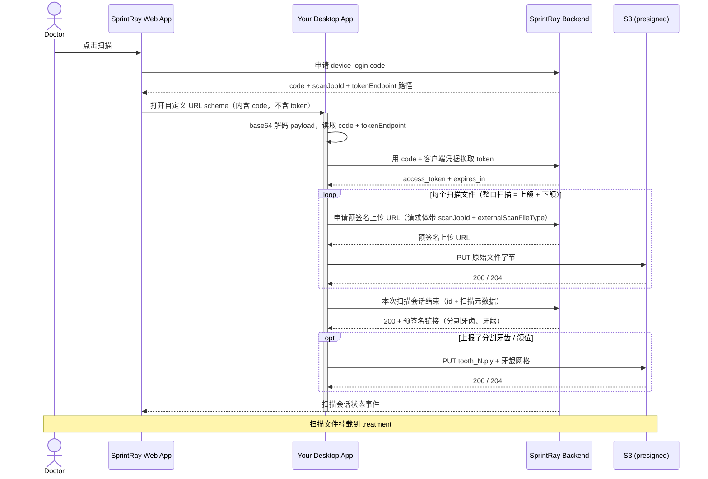

# SprintRay 桌面扫描仪集成 — 示例应用

[English](./README.md) | 中文

https://github.com/user-attachments/assets/80a45043-70d4-439b-bcf5-5d6698d452ce

**一个来回全在里面**(53 秒,无声)—— 医生在网页端点开始扫描,本应用接管,依次扫上颌、下颌、
咬合,真的把这一单发出去,然后主动让位,浏览器回到前台,牙弓已经传上去了。其中扫描处理与上传做了
加速,其余为原速。离线阅读可看仓库内同一份文件:[`docs/demo-mode.mp4`](./docs/demo-mode.mp4)。

一个**桌面应用侧**的参考实现与**示例应用**,对应 SprintRay 的 device-login + 扫描文件上传集成。
用它理解整个流程,并在把逻辑接入你真实的桌面扫描仪应用之前完成端到端联调。

它在**同一套完整埋点的流程**(`src/core/`)之上提供两个前端:

- **桌面 UI(Electron)** —— `npm run app` —— 含两套界面:**演示模式**待机等待拉起,收到 payload 后
  仿真一次真实的椅旁扫描、真的把这一单发给 SprintRay,然后把屏幕交回浏览器;**开发者模式**展示解析
  出的启动 payload、逐步骤的实时流水线,
  以及**每一次 HTTP 请求的完整 request 与 response**,让测试者能观测到完整的数据流。连续按五次
  `d` 切换(见 [桌面 UI](#桌面-uielectron));
- **命令行运行器** —— `npm start` —— 同一套流程,输出到控制台。

两个前端还都会提供 **`127.0.0.1` 上的本机 HTTP 服务** —— 除 URL scheme 之外,Web 端触达桌面扫描仪的
第二条路径(见[本机 HTTP 服务](#本机-http-服务127001))。

命令行及其核心为**零依赖**(仅 Node.js ≥ 18 内置能力);Electron 仅作为可选的 `devDependency`,只在
运行 UI 时才需要,`electron-builder` 只在打包时才需要。

## 集成流程

从你的桌面应用视角,共五步 —— **无浏览器、无需重新登录,且 token 绝不出现在启动 URL 中**:

1. **拉起。** 在 treatment 页面,SprintRay Web 端通过你注册的自定义 URL scheme 拉起你的应用,
   并带上一段 base64 编码的 JSON —— `yourscheme://<base64_json>` —— 其中只含一个**一次性、短时效的 `code`**。
   (同一份 payload 也可以改为经[本机 HTTP 服务](#本机-http-服务127001)送达,前提是你的应用运行了该服务。)
2. **解码。** 对 payload 做 base64 解码,读取 `code`、token 接口路径,以及 treatment / case 标识
   (见[启动 payload](#启动-payload))。
3. **换取 token。** 通过 HTTPS 把 `code` + 你的客户端凭据 POST 上去,换取已登录医生的 `access_token`。
4. **上传。** 扫描仪一次就把上下颌都扫完,所以整口扫描(启动 payload 的 `fileType` 为 `null`)会为**两个**文件
   各申请一次预签名上传 URL 并分别 PUT;`fileType` 指定某一颌时只传那一个。每次上传都要声明这个文件是什么
   扫描类型(`externalScanFileType`)。扫描文件会自动挂到 treatment 上。
5. **收尾。** 调用一次扫描结束接口,并随调用上报本次会话扫到了什么 —— 扫描模式、缺失牙位、分割牙齿、
   扫了哪几颌。SprintRay 会返回一批预签名链接,你把分割牙齿与牙龈网格 PUT 上去即可。所有元数据字段
   都是可选的:什么都不报,这个调用照旧把会话收尾,与此前完全一致。

### 流程



### 启动 payload

```json
{
  "caller": { "name": "SprintRay", "version": "1.0.10.0" },
  "case": { "name": "<患者姓名>", "ID": "<scan-job id>" },
  "treatment": {
    "teeth": [
      { "teeth": 3, "notes": "", "toothApplianceType": 3, "groupNumber": null }
    ]
  },
  "fileType": null,
  "language": "en_US",
  "serverType": 0,
  "toothSystem": "fdi",
  "auth": {
    "code": "<one-time-code>",
    "tokenEndpoint": "/integration/device-login-token",
    "expiresIn": 600
  },
  "treatmentId": "<treatment id>",
  "externalCaseId": "<external case id>"
}
```

| 字段 | 用途 |
|---|---|
| `caller` | 拉起方(`SprintRay` + Web 端版本) |
| `case.name` | 患者显示名 |
| `case.ID` | **本次拉起的扫描会话**。每次上传以及扫描结束调用都要把它作为 `scanJobId` 传回 |
| `treatment.teeth[]` | 选中的牙位 —— `teeth`(牙号)、`notes`、`toothApplianceType`、`groupNumber` |
| `fileType` | 请求的文件类型(`TreatmentFiles`;见 [枚举](#枚举));整口扫描时为 `null`,此时上下颌两个文件都要上传 |
| `language` | 界面语言,如 `en_US` |
| `serverType` | 服务器类型标识 |
| `toothSystem` | 牙位编号系统:`fdi` 或 `utn` |
| `auth.code` | 用于换取 token 的一次性 device-login code |
| `auth.tokenEndpoint` | token 接口**路径** —— 拼接到后端 origin 之后 |
| `auth.expiresIn` | code 有效期(秒) |
| `treatmentId` | 上传的扫描文件要挂载到的 treatment |
| `externalCaseId` | 可选的 case 引用;**SprintRay Web 端不下发,通常为 null**。有值时在上传里原样带回。它不是会话标识 —— 两次拉起可能带同一个值 —— 标识会话、可用于关联的只有 `case.ID` |

> `auth`、`treatmentId`、`externalCaseId` 是 SprintRay 的静默鉴权与上传上下文;
> 其余为标准 ScanPro 启动 payload。

## 接口约定

共三个调用。它们都经由 SprintRay API 网关,`{ORIGIN}` 为对应环境下固定的网关 origin:

| 环境 | `{ORIGIN}` |
|---|---|
| 开发 | `https://dev-apx.sprintray.com` |
| 预发 | `https://staging-apx.sprintray.com` |
| 生产 | `https://apx.sprintray.com` |

对应环境的 origin 由 SprintRay 提供。

**每个调用都必须带上 `x-api-key`** —— SprintRay 为你的集成签发的网关 API key(与 client id / client
secret 是两回事:API key 标识调用方并决定限流额度,client 凭据用于换取医生 token)。缺少该头会在
请求到达 SprintRay 后端之前被网关以 `403` 拒绝。

> 网关路径**不含** `/api` 前缀。请始终使用启动 payload 中的 `auth.tokenEndpoint` 拼接 token 接口,
> 不要写死路径 —— 该字段就是为了让 SprintRay 能在不改动你的应用的前提下调整路由。

### 1. 用 code 换取 token

```http
POST {ORIGIN}{auth.tokenEndpoint}
x-api-key: <your-api-key>
Content-Type: application/json

{ "code": "<code>", "clientId": "<your-client-id>", "clientSecret": "<your-client-secret>" }
```

`200 → { "access_token": "…", "token_type": "Bearer", "expires_in": 86400 }`

错误:`400` code 缺失/过期/已使用 · `401` 客户端凭据错误 · `403` 缺少或无效的 `x-api-key`。
token 过期后,重新拉起以获取新 token。

### 2. 申请预签名上传 URL,再 PUT 文件

```http
POST {ORIGIN}/integration/file/upload
Authorization: Bearer <access_token>
x-api-key: <your-api-key>
Content-Type: application/json

{ "fileName": "upper.stl", "fileSize": 3083734, "treatmentId": "<treatment-id>",
  "scanJobId": "<启动 payload 中的 case.ID>",
  "treatmentFileType": 1, "arch": 1, "externalScanFileType": "UpperArch",
  "externalCaseId": "<external-case-id>" }
```

`200 →` 一个预签名上传 URL(JSON 字符串,或 `{ "url": "…" }`)

```http
PUT <presignedUrl>
Content-Type: application/octet-stream
Content-Length: <fileSize>

<原始文件字节>
```

成功返回 `200`/`204`。PUT 请求**不带**鉴权头 —— 预签名 URL 自带授权。

- `scanJobId`:即启动 payload 中的 `case.ID`,标识该文件所属的扫描会话。**每次上传都要带上** ——
  SprintRay 靠它跟踪会话进度;对于不携带 treatment 的拉起,这也是其上传能被记录下来的唯一途径。
  `treatmentId` 仍各司其职,负责把文件绑定到 treatment,两者并存。
- `externalScanFileType`:**每次上传必传。** 即**你自己对这个文件的命名** —— `UpperArch`、`LowerJaw`、
  `BiteScan`,你的应用本来怎么叫就怎么传,不必迁就 SprintRay 的编号。SprintRay 首次见到某个名字时,
  会把它登记在你这个集成名下;之后由 SprintRay 管理员一次性把它映射到对应的 SprintRay 文件类型和/或
  indication,从此以该名字上传的文件,其文件类型就**由该映射决定**,优先于你传的 `treatmentFileType`。
  映射建立之前,文件照样保存、照样记录在会话上,只是没有 SprintRay 文件类型 —— 所以请在联调阶段就把
  **你的应用会用到的名字清单**交给 SprintRay
  (见〈你需要向 SprintRay 索取的信息〉),而不是等第一次上传把名字带进来。匹配时不区分大小写,
  但 SprintRay 存下来的是它第一次见到的写法,因此每次都用同一种拼写。
- `treatmentFileType`:**`1` = 上颌,`2` = 下颌**。可选,且只作**兜底**:当你的 `externalScanFileType`
  已经映射到某个 SprintRay 文件类型时,文件类型由该映射决定,这里传的值不生效。它只负责映射给不出结果
  的情形 —— 名字已登记、但还没映射到文件类型 —— 所以联调阶段请一并带上;等你的名字都映射好之后,
  它就不再影响结果了。
- `arch`(可选):**`1` = 上颌,`2` = 下颌**。这个文件扫的是哪一颌。没有具体颌位的文件(比如咬合扫描)
  可以不传。扫描结束调用上报的元数据正是按它来分配的,所以不传 `arch` 的文件不会被挂上缺失牙位与
  分割牙齿信息。
- 扫描文件为 **STL** 格式。

### 3. 告知 SprintRay 本次扫描会话已结束

在**最后一个扫描文件上传完成后调用一次**。上传文件本身并不表示"扫描结束":SprintRay 只能看到每颌各一个
上传事件,无法区分"上颌到了"与"医生扫完了"。这个调用负责把会话收尾,并推送 Web 端一直在等的事件,
医生的浏览器据此离开扫描页面。

同时,它也是你**上报本次会话扫到了什么**的地方 —— 扫描模式、缺失牙位、分割牙齿、扫了哪几颌 ——
SprintRay 则在响应里给出分割牙齿与牙龈网格的预签名上传链接。

```http
POST {ORIGIN}/integration/scan-job/complete
Authorization: Bearer <access_token>
x-api-key: <your-api-key>
Content-Type: application/json

{
  "id": "<启动 payload 中的 case.ID>",
  "scanMode": "quickScan",
  "hasUpper": true,
  "hasLower": true,
  "missingTeeth": [1, 16],
  "segmentedTeeth": [
    { "toothNumber": 8, "filename": "tooth_8.ply", "confidence": 0.97 }
  ]
}
```

`200 →` 结束后的会话,外加你上报的每个网格各一条预签名 PUT 链接:

```json
{ "id": "<scan-job id>", "treatmentId": "<treatment id 或 null>", "caseId": "<external case id>",
  "status": 3, "externalProviderId": "scanpro",
  "files": [ { "fileType": 1, "fileGuid": "…", "status": 3 } ],
  "scanMode": "quickScan", "missingTeeth": [1, 16], "hasUpper": true, "hasLower": true,
  "segmentedTeethUploadLinks": [ { "toothNumber": 8, "url": "https://…" } ],
  "gingivaUploadLink": { "upper": "https://…", "lower": "https://…" },
  "createdDate": "2026-08-20T07:31:00Z", "modifiedDate": "2026-08-20T07:36:12Z" }
```

- `id` 是定位会话的键,就是启动 payload 里的 `case.ID`。`scanJobId` 是同一个字段的旧名字,**仍然受支持**,
  已发布的应用无需改动;两者都传时以 `id` 为准。
- 只有在你确实没有保留该 id、且当初拿到过 `externalCaseId` 时,才可以用 `caseId` **替代**它 ——
  SprintRay Web 端并不下发它,通常为 null。而且它本身就是更弱的键:case id 并非每次拉起唯一,
  SprintRay 会取携带该值的最新会话。请保留 `case.ID`,它一定有值。
- **所有元数据字段都是可选的。** 只传 `{ "id": "…" }` 的请求体,与此前完全一样地结束会话 ——
  你的扫描仪实际产出什么就报什么。
- `scanMode`:**用你自己的词汇** —— `quickScan`、`restorative`,你的应用怎么叫就怎么传,与上传调用里的
  `externalScanFileType` 是同一套约定。SprintRay 首次见到某个名字时会把它登记在你这个集成名下;
  存下来的是第一次见到的写法,所以请保持稳定。
- `missingTeeth` 与 `segmentedTeeth[].toothNumber` 一律是**通用牙位编号(Universal,1-32)** ——
  启动 payload 里的 `toothSystem` 只影响展示,与这个调用无关。
- `hasUpper` / `hasLower`:本次会话是否扫了对应那一颌。牙龈链接由它们决定 —— 没有 `hasLower`,
  就没有 `gingivaUploadLink.lower`。
- `segmentedTeeth[]` 声明的是你**接下来要上传**的逐牙网格:牙位号 `toothNumber`、你将使用的文件名
  `filename`、以及分割置信度 `confidence`。每颗牙返回一条链接,放在 `segmentedTeethUploadLinks` 里。
- **幂等,元数据也一样。** 重试会重新签发指向**同一批**对象的链接,已经 PUT 上去的网格不会丢;
  上报的元数据是覆盖写,所以用同样的请求体重试会收敛到同一结果。对已经结束的会话上报元数据同样有效 ——
  提交 treatment 会在 SprintRay 侧把会话结束掉,这一步有可能先于你的调用发生。
- 会话一旦结束就不再接收**扫描文件**上传。重扫是一次新的拉起、一个新的会话。本次调用拿到的网格链接
  仍然可用(见下)。

拿到链接后,逐个把网格 PUT 上去:

```http
PUT <segmentedTeethUploadLinks[].url | gingivaUploadLink.upper | gingivaUploadLink.lower>
Content-Type: application/octet-stream
Content-Length: <fileSize>

<原始网格字节>
```

- 规则与扫描文件的 PUT 相同:**不带**鉴权头,成功返回 `200`/`204`。链接有效期为 **30 分钟** ——
  过期后再调一次结束接口,即可拿到指向同一批对象的新链接。
- 对象的扩展名取自你上报的 `filename`(`tooth_8.ply`)。上报时没给文件名的牙齿,以及所有牙龈网格,
  由 SprintRay 命名,默认使用 **`.ply`**。
- PUT 之后**不需要再调任何接口** —— 没有 confirm,也不用再调一次结束接口。这些网格属于会话元数据,
  不是 treatment 文件:它们不会挂到 treatment 上,也不会出现在医生的 Cloud Drive 里。

错误:`400` 完全没传 id、牙位号超出 1-32、同一个 `toothNumber` 出现两次,或 `filename` 的扩展名不被允许 ·
`401` access token 缺失或过期 · `403` 缺少或无效的 `x-api-key` · `404` 会话不存在,**或**属于其他医生
(两者故意不作区分)。

### 4. 读取扫描会话（可选）

你的应用并不需要这个接口,这里列出是因为它是同一个会话资源。它回答的是"SprintRay 目前收到了哪几颌、
会话处于什么状态" —— 扫描中途出问题、想确认到底落了哪些文件时有用。

```http
GET {ORIGIN}/integration/scan-job/{scanJobId}
Authorization: Bearer <access_token>
x-api-key: <your-api-key>
```

`200 →` 与结束调用相同的响应结构,但不含上传链接 —— 包含上报过的 `scanMode`、`missingTeeth`、
`hasUpper`、`hasLower`(未上报过的会话上这些为 null)。错误同上:`401` · `403` · `404`。

`status` 取值:`1` pulled · `2` transferring · `3` done。文件级 `status`:`1` pending ·
`2` uploaded · `3` 已挂载到 treatment。两个来源都给不出结果时,该文件的 `fileType` 为 `null` ——
即它的 `externalScanFileType` 没有映射到文件类型,上传也没有带 `treatmentFileType`。

## 枚举

payload 与上传调用中用到的数值枚举。

### `treatmentFileType` / `fileType` —— `TreatmentFiles`

上传时作为 `treatmentFileType` 发送,在启动 payload 中作为 `fileType` 收到。口内扫描只需:

| 值 | 名称 |
|---|---|
| `1` | UpperJaw(上颌) |
| `2` | LowerJaw(下颌) |

<details>
<summary>全部 <code>TreatmentFiles</code> 取值</summary>

| 值 | 名称 |
|---|---|
| 1 | UpperJaw |
| 2 | LowerJaw |
| 3 | LeftSide |
| 4 | RightSide |
| 5 | Other |
| 6 | Spr |
| 7 | SingleStl |
| 8 | DesignPhoto |
| 9 | CBCT |
| 10 | SingleStlWithSupports |
| 11 | BaseStl |
| 12 | BaseSpr |
| 13 | PonticStl |
| 14 | PonticSpr |
| 15 | PatientPhoto |
| 16 | SurgicalGuideStl |
| 17 | SurgicalGuideSpr |
| 18 | CementedRestorationStl |
| 19 | CementedRestorationSpr |
| 20 | RemovableDieStl |
| 21 | RemovableDieSpr |
| 22 | CustomBleachingTrayStl |
| 23 | CustomBleachingTraySpr |
| 24 | WaxUpUpperStl |
| 25 | TrialSmileUpperStl |
| 26 | WaxUpSpr |
| 27 | TrialSmileSpr |
| 28 | DesignVideo |
| 29 | MonolithicTryInDentureStl |
| 30 | MonolithicTryInDentureSpr |
| 31 | DentureGumBaseStl |
| 32 | DentureGumBaseSpr |
| 33 | DentureTeethStl |
| 34 | DentureTeethSpr |
| 35 | WaxUpLowerStl |
| 36 | TrialSmileLowerStl |
| 37 | CephXRayPhoto |
| 38 | PanoXRayPhoto |
| 39 | FrontFace |
| 40 | FrontSmile |
| 41 | RightSideFace |
| 42 | LeftSideFace |
| 43 | FrontTeeth |
| 44 | RightSideTeeth |
| 45 | LeftSideTeeth |
| 46 | UpperJawImage |
| 47 | LowerJawImage |
| 48 | PreppedToothIntraoralScans |
| 49 | DentureWaxSetup |
| 50 | UpperTissueScan |
| 51 | LowerTissueScan |
| 52 | PhotogrammetryData |
| 53 | MonolithicHybridDenturesStl |
| 54 | MonolithicHybridDenturesSpr |
| 55 | AICrownPreviewImage |
| 56 | AICrownStl |
| 57 | AICrownDieStl |
| 58 | BiteScanCombo |
| 59 | DentureUpperStl |
| 60 | DentureLowerStl |
| 61 | SmileDesignStl |
| 63 | SmileDesignFrontSmile |
| 64 | UpperJawRetainer |
| 65 | LowerJawRetainer |
| 66 | UpperJawAligner |
| 67 | LowerJawAligner |
| 68 | SprRetainer |
| 69 | SprAligner |
| 70 | UpperAppliance |
| 71 | LowerAppliance |
| 72 | UpperAntagonist |
| 73 | LowerAntagonist |
| 74 | VeneersDesignFrontSmile |
| 75 | VeneersStl |
| 76 | VeneersSpr |
| 77 | PreppedUpperJaw |
| 78 | PreppedLowerJaw |
| 79 | DentalModelDieStl |
| 80 | Link |
| 81 | ImplantCrownStl |
| 82 | ImplantShellTempStl |
| 83 | ImplantBridgeStl |
| 84 | UpperDirectPrintAppliance |
| 85 | LowerDirectPrintAppliance |
| 86 | UpperDirectPrintTemplate |
| 87 | LowerDirectPrintTemplate |
| 88 | SingleStlOnlyView |
| 89 | UpperJawOnlyViewStl |
| 90 | LowerJawOnlyViewStl |
| 91 | TrackingLink |
| 92 | PartialDentureBaseStl |
| 93 | PartialDentureBaseSpr |
| 94 | TreatmentTeethImage |
| 95 | AISmilePreviewImage |
| 96 | AISmilePreviewVideo |
| 97 | PreOpUpperJaw |
| 98 | PreOpLowerJaw |
| 99 | CorrectedUpperJaw |
| 100 | CorrectedLowerJaw |
| 101 | Profile45Degree |
| 102 | UpperScanbodyScan |
| 103 | LowerScanbodyScan |

`62` 未使用。

</details>

### `treatment.teeth[].toothApplianceType` —— `ToothApplianceType`

| 值 | 名称 |
|---|---|
| 1 | PonticSites |
| 2 | Clasps |
| 3 | Crown |
| 4 | SplintCrown |
| 5 | Splint |
| 6 | Inlay |
| 7 | Onlay |
| 8 | ShellTemp |
| 9 | Wings |
| 10 | Base |
| 11 | Extraction |

### `arch` —— `ArchType`

一次上传扫的是哪一颌(上传调用里的 `arch`)。可选 —— 没有具体颌位的文件(比如咬合扫描)可以不传。

| 取值 | 含义 |
|---|---|
| `1` | 上颌 |
| `2` | 下颌 |

### `toothSystem`

由医生的牙位编号偏好(`DentalNotation`)映射而来的字符串:

| `toothSystem` | 含义 |
|---|---|
| `utn` | 通用牙位编号 Universal Tooth Numbering(`DentalNotation.Utn` = 1)—— 默认 |
| `fdi` | FDI 世界牙科联盟编号(`DentalNotation.Fdi` = 2) |

它决定的是牙位**如何展示给医生**。你发给 SprintRay 的牙位号 —— 扫描结束调用里的 `missingTeeth` 与
`segmentedTeeth[].toothNumber` —— 一律是**通用编号(1-32)**,与 `toothSystem` 无关。

### `serverType`

目前没有为其定义枚举,始终为固定值 `0`。

## 你需要向 SprintRay 索取的信息

| 值 | 环境变量 | 说明 |
|---|---|---|
| 网关 origin | `SCANPRO_BASE_URL` | 按环境固定(dev / staging / prod,见上表) |
| 网关 API key | `SCANPRO_API_KEY` | 作为 `x-api-key` 发送;标识调用方并决定限流额度 |
| Client ID | `SCANPRO_CLIENT_ID` | 你集成的公开 id |
| Client Secret | `SCANPRO_CLIENT_SECRET` | 仅保存在服务端 / 你的应用内 |
| URL scheme | `SCANPRO_URL_SCHEME` | 你的应用注册的 scheme,如 `openScanPro` |
| 遥测接口地址 | `SCANPRO_TELEMETRY_URL` | 仅用于端口耗尽事件;按环境下发 |
| 遥测 API key | `SCANPRO_TELEMETRY_API_KEY` | 遥测接口唯一的凭据 |

还有一项不属于凭据,而且方向相反,但属于同一批联调事项:`externalScanFileType` 每次上传必传,
所以请把**你的应用会用到的名字清单**(连同扫描结束调用里的 `scanMode` 名字)提供给 SprintRay,
由管理员把每个名字映射到对应的 SprintRay 文件类型 / indication。名字映射之前,以它上传的文件
不带 SprintRay 文件类型。

## 运行示例应用

前置条件:Node.js ≥ 18(`--env-file` 需 ≥ 20.6)。支持 macOS / Windows / Linux(scheme 注册以 macOS 为已验证路径)。

```sh
cp .env.example .env      # 填入 origin、client id/secret、scheme
```

## 桌面 UI(Electron)

```sh
npm install               # 会安装 Electron(devDependency)
npm run app               # 启动桌面 UI
```

同一套流程上有**两套界面**,任何时候**连续按五次 `d`** 即可互相切换:

| 界面 | 用途 | 是否默认进入 |
|---|---|---|
| **演示模式(Demo)** | 展示这套集成在医生眼里是什么样 | 是 |
| **开发者模式(Developer)** | 联调集成、查看网络流量 | `SCANPRO_UI_MODE=dev` |

### 演示模式

[开头那段视频](#sprintray-桌面扫描仪集成--示例应用)录的就是这套界面。

对真实口内扫描仪软件的仿真:暗色舞台、两侧工具栏、实时相机预览、扫描质量图例。它的**生命周期就是
桌面应用真实的那一套**,和开发者模式一致:

1. **待机。** 窗口空转等待,卡片上写着当前可用的拉起通道(URL scheme,以及本机服务监听的端口)。
   不扫任何东西。
2. **收到启动 payload** —— 来自系统 URL scheme,或本机服务的 `POST /scanpro/v1/start` —— 这一单
   开始播:上颌在虚拟扫描杖下逐步生成(用的是随包的 STL 牙弓,按扫描顺序逐三角面显现,原始网格上
   标出空洞与分层),接着下颌,然后咬合配准,最后一遍精修:补洞、平滑,得到最终模型。患者姓名、
   case id、选中的牙位都取自 payload;payload 指定了 `fileType` 时只扫那一个牙弓。播放中又来了新
   payload,则按新的这一单重新开始。
3. **返回浏览器。** 这一单发出去之后,完成卡倒计时结束,应用主动让位 —— macOS 上隐藏、Windows 上
   最小化 —— 医生原来那个页面重新回到前台;下一次拉起会把窗口带回来。上传失败则卡片留在屏幕上,
   等人手动关掉。

**上传是真的。** 它调用的就是开发者模式里那个 `runFlow()`:只要 `.env` 里的凭据齐全,这一单就真的
会走完换 token、上传、结束扫描会话 —— 卡片上的进度是真实的 HTTP 进度,完成卡上的 treatment 与文件
大小也是后端实际接收的。缺少凭据时,卡片会写明原因,传输为模拟。

### 开发者模式

推荐用于联调的方式。它运行与命令行完全相同的流程,但以可视化方式呈现,便于观测每个步骤并检查
网络上传输的每一个字节。窗口分三块:

- **左侧 —— 配置与输入。** 网关 origin、API key、client id/secret、URL scheme 会从 `.env` 预填(可按次修改)。
  粘贴 `openScanPro://<base64>` **启动 URL**,或切到 **Manual code** 用显式 `code` + treatment id 运行;
  还可分别为上颌、下颌指定自定义扫描文件,并勾选是否额外走 token 刷新步骤。
- **右侧 —— 观测区。**
  - **Pipeline** —— 桌面应用侧的步骤按序展示(解析 → 换 token → 可选刷新 → 预签名 URL → S3 PUT),
    每步显示实时状态与一行摘要。
  - **Decoded launch payload** —— 解析出的字段(`code`、`tokenEndpoint`、`treatmentId`、
    `externalCaseId`、`fileType`)以及完整的解码 JSON;**Decode payload** 可在不发起网络请求的情况下预览。
  - **HTTP transactions** —— 每次调用一张可展开的卡片,包含**完整 request**(method、URL、headers、body)
    与**完整 response**(status、headers、body、耗时);body 会格式化并可复制,S3 PUT 的 body 显示为
    `<binary N bytes>`。
  - **Log** —— 与命令行一致的带时间戳 step/ok/fail/info 流。

**从浏览器拉起。** 应用会把自身注册为该 URL scheme 的系统处理器(`app.setAsDefaultProtocolClient`),
因此在 SprintRay 网页点击 **OR Scan** 可直接拉起它 —— 深链会落入启动 URL 输入框并自动解析。右上角
**Claim handler** 按钮可重新抢占 scheme;macOS 上打包后的构建更可靠,开发期直接粘贴启动 URL 最稳妥。

### 注册 URL scheme(真实的系统拉起)

让操作系统把 `yourscheme://…` 路由到本示例应用,这样在浏览器里点击拉起入口即可真实启动它:

```sh
npm run register      # 向操作系统注册 scheme
npm run status        # 查看该 scheme 当前解析到哪里
npm run unregister    # 移除
```

- **macOS**:会在 `~/Applications` 下创建一个 app;首次拉起会请求"控制 Terminal"(用于展示运行过程)
  —— 点 **OK**,或用 `npm run register -- --headless` 改为输出到日志文件。改动代码或 `.env` 后需重新 `register`。
- **Windows / Linux**:注册为当前用户级处理器(注册表 / `.desktop`)。

### 直接对启动 URL 运行

```sh
# 形式 A —— 浏览器交过来的深链
node --env-file=.env src/index.js "yourscheme://<base64_json>"

# 形式 B —— 显式传入 code(无启动 URL)
node --env-file=.env src/index.js --code <code> --base-url <origin> --treatment-id <guid>
```

追加 `--demo-refresh` 可一并演示 token 刷新接口;`--upper-file <p>` / `--lower-file <p>` 可替换某一颌
要上传的文件。

### 它做了什么

每次运行会:换取 token,然后按扫描仪的真实行为上传 —— 整口扫描(`fileType` 为 `null`)依次上传
`fixtures/upper.stl` 与 `fixtures/lower.stl` 两个文件,`fileType` 指定某一颌时只上传那一个 —— 
每个文件都带实时进度条。最后一个文件上传完成后会发起扫描结束调用,让整个流程与真实会话一致。
形式 B(`--code`,无启动 URL)没有 `case.ID`,也就没有会话可结束,该步骤会标记为 skipped。
**每个后端请求与响应都会被完整打印**(方法、URL、请求头、请求体 / 状态码、响应头、响应体),
让你清楚地看到该发送什么、该期望什么。把 `fixtures/` 里的文件替换成你自己的扫描件即可测试其它数据。

## 本机 HTTP 服务(`127.0.0.1`)

Web 端触达桌面应用的**第二条路径**。不走系统 URL scheme,而是由浏览器在回环地址上探测一个固定端口
区间,找到常驻服务后把 payload POST 过去。两条路径携带的是**同一份** base64 JSON payload,在本示例
应用里也都落到同一个窗口。

本应用实现了该契约的服务端,你可以把 Web 端直接指过来,看到调用方真实看到的一切 —— 尤其是 CORS 行为,
浏览器访问回环地址的集成通常就断在这里。

桌面 UI 启动时会自动拉起该服务,右上角 **server** 芯片显示它占用的端口(悬停可看接口列表)。
不带 Electron 单独运行:

```sh
npm run serve                  # 占用端口;/start 通过 URL scheme 拉起桌面应用
npm run serve -- --run-flow    # /start 改为在进程内换取 token 并上传扫描文件
npm run serve -- --help        # 全部选项:端口区间、上报的版本/状态、Host 校验开关
```

无头模式下,`/start` 会像真实的常驻服务那样拉起应用 —— 把 payload 交给该 URL scheme 的系统处理器,
于是 `npm run register` 注册的、或已安装的构建就是被拉起的那个。拉起之后还会**做确认**:启动器返回 0 只
代表系统受理了请求,一个启动后立刻退出的陈旧处理器本来会被当成成功,所以响应里报的是实际结果:

| `errorCode` | 含义 |
|---|---|
| `NO_HANDLER_REGISTERED` | 没有程序认领该 scheme —— 安装一个构建,或执行 `npm run register` |
| `LAUNCH_NOT_CONFIRMED` | 系统受理了启动,但没有进程活下来(通常是陈旧的处理器) |
| `LAUNCH_FAILED` | 系统启动器本身报错 |

### 服务发现

**没有固定端口** —— 服务取第一个能监听成功的端口,因此调用方必须探测。两侧必须对齐同一个区间:

| | |
|---|---|
| 端口区间 | `29083`–`29183`(含),共 101 个 |
| 选取方式 | 启动时从 `29083` 起逐个尝试,第一个能监听的即为所用 |
| 监听地址 | 仅 `127.0.0.1`,不监听外部网卡 |
| 区间耗尽 | **不启动** HTTP Server,改为上报遥测(见下) |

**调用方的探测约定:** 从 `29083` 起逐个端口调用 `GET /scanpro/v1/status`,第一个返回 `200` 且响应体中
`"service": "SprintRayScanService"` 的端口即为本服务。命中后**缓存该端口**并复用,仅在请求失败时重新探测。

> 用 `service` 判定很重要。只凭响应里有没有 `version` 字段,无法把本服务和恰好占用该端口的其它程序区分开。

### `GET /scanpro/v1/status`

安装状态、运行状态与版本一次返回,不需要分两次探测。

```console
$ curl -s http://127.0.0.1:29083/scanpro/v1/status
{"service":"SprintRayScanService","running":true,"installed":true,"version":"0.2.0"}
```

| 字段 | 类型 | 说明 |
|---|---|---|
| `service` | string | 恒为 `SprintRayScanService` —— 服务发现的判据 |
| `running` | bool | ScanPro 正在运行 |
| `installed` | bool | ScanPro 已安装 |
| `version` | string | ScanPro 版本号 |

### `POST /scanpro/v1/start`

用一份启动 payload 拉起 ScanPro。**这是同步阻塞接口** —— 请求会一直挂起到启动成功或失败为止,请设置足够
长的超时;并且超时后**不要**直接重试,先用 `/status` 确认 ScanPro 是不是其实已经起来了。

`argument` 是 **Base64 编码后的 JSON** 启动 payload —— 和 URL scheme 携带的是同一份。必填,且不能为空字符串。

```sh
ARGUMENT=$(node -e 'console.log(Buffer.from(JSON.stringify({
  caller: { name: "SprintRay", version: "1.0.10.0" },
  case:   { name: "Jane Doe", ID: "04024e3b-ff28-4d6a-bdea-4c777e4cfb0d" },
  language: "en_US", serverType: 0, toothSystem: "fdi",
  treatment: { teeth: [{ number: "17", workType: "Crown" }] }
})).toString("base64"))')

curl -s -X POST http://127.0.0.1:29083/scanpro/v1/start \
  -H 'Content-Type: application/json' \
  -d "{\"argument\":\"$ARGUMENT\"}"
```

```json
{ "status": true, "started": true }
```

`status` 是契约当前定义的字段;`started` 是同一个值的更清晰命名,两者一起返回,按哪个读都行。启动失败时
会额外带上 `errorCode` 与 `message`。

如果 payload 里同时带了 SprintRay 的 `auth` 块,这就是一次完整的启动:桌面 UI 会把窗口切到前台并展示解码
后的 payload;`serve --run-flow` 下,示例应用会先换取 token、上传扫描文件,再返回这个请求。

### 错误

`200` 只代表**请求被正确处理**,不代表业务成功 —— "ScanPro 未安装"同样是 `200`,由 `installed: false`
表达。真正的错误用状态码 + 固定信封表达:

```json
{ "error": { "code": "ARGUMENT_REQUIRED", "message": "`argument` is required and must be a non-empty string" } }
```

| 状态码 | `code` | 触发条件 |
|---|---|---|
| `400` | `INVALID_JSON` | 请求体不是合法 JSON |
| `400` | `ARGUMENT_REQUIRED` | `argument` 缺失、不是字符串,或为空 |
| `400` | `ARGUMENT_NOT_BASE64_JSON` | `argument` 解不出 JSON 对象 |
| `403` | `HOST_NOT_ALLOWED` | `Host` 头不是回环名称(见下) |
| `404` | `NOT_FOUND` | 路径不存在 |
| `405` | `METHOD_NOT_ALLOWED` | 路径对、方法不对 |
| `413` | `PAYLOAD_TOO_LARGE` | 请求体超过 256 KB |
| `500` | `START_ERROR` / `STATUS_ERROR` | 服务自身出错 |

`code` 是稳定常量 —— 请对它做分支,不要对 `message` 做分支。

### CORS 与 Chrome 的 Private Network Access

调用方是 HTTPS 页面访问 `http://127.0.0.1`,属于跨源。缺了正确的响应头,请求即使成功,浏览器也会把响应
丢掉。因此本服务:

- 把请求的 `Origin` 回显到 `Access-Control-Allow-Origin`,并始终返回 `Vary: Origin`;
- 对 `OPTIONS` 预检返回允许的方法与请求头;
- 对带 `Access-Control-Request-Private-Network: true` 的预检返回
  `Access-Control-Allow-Private-Network: true` —— **缺这一条 Chrome 会直接拦掉**。

默认回显任意 Origin,这样最便于联调。把 `SCANPRO_LOCAL_SERVER_ORIGINS` 设为逗号分隔的列表即可改成白名单,
名单外的来源拿不到 `Access-Control-Allow-Origin`,浏览器会拦截。

本服务无鉴权,安全性完全依赖"只能从回环访问"。而这个前提只在请求确实是发往回环时才成立,所以 `Host` 头
为其它名称的请求 —— 也就是 DNS rebinding 攻击的形态 —— 会被 `403` 拒绝。调试代理时可用 `--allow-any-host`
关掉该校验。

### 端口区间被占满时

101 个端口全被占用时服务不会启动,Web 端探测不到任何端口,在医生看来就只是"点击扫描没反应"。这台机器上
没有任何人会察觉,所以必须由服务自己上报:

| | |
|---|---|
| `eventName` | `local_server.port_unavailable` |
| `severity` | `error` |
| `eventData` | `{ portRangeStart, portRangeEnd, attempted, lastErrorCode }` |

批次中 `app.name` 填 `ScanPro`,不带 `userId`(服务在任何人登录之前就已启动,填占位值比不填更糟),
也不带 `scanner`。只有同时配置了 `SCANPRO_TELEMETRY_URL` 与 `SCANPRO_TELEMETRY_API_KEY` 才会发送,
否则只记本地日志。`deviceId` 是操作系统机器标识的 SHA-256,`installationId` 生成一次后落盘,
两者都存放在 `~/.sprintray-scanpro-example/`(打包版则在应用的用户数据目录)。

### 相对文档契约的增补

四处增补,均向后兼容 —— 客户端忽略它们也能正常工作:

| 增补 | 原因 |
|---|---|
| `/status` 增加 `service` | 端口探测时,仅凭 `version` 无法确认这是不是本服务 |
| 4xx/5xx 统一为 `{ error: { code, message } }` | 契约只定义了成功响应;`code` 是稳定常量,不是本地化文案 |
| `status` 之外并列返回 `started` | `/status` 用的是语义化命名(`running` / `installed`),`/start` 返回泛化的 `status` 读起来不一致 |
| 回环 `Host` 校验 | 否则一个无鉴权的回环服务会信任任何解析到 `127.0.0.1` 的域名 |

有一处行为是刻意不同的:真实服务会把 `argument` 原样交给 ScanPro,而本服务会解码它,解不开就直接返回
`400`。这正是模拟器的价值 —— 让你在这里就发现 payload 有问题,而不是盯着一个毫无反应的扫描仪。

## 退出码

- `0` —— 换取 token 且全部上传成功(或 register/status/unregister 命令完成)
- `1` —— 参数错误、缺少环境变量、换取 token / 上传失败,或 `serve` 找不到可用端口

## 构建安装包

```sh
npm run dist:win     # Windows x64 → release/*.exe(NSIS 安装包)
npm run dist:mac     # macOS arm64 → release/*.dmg + *.zip
```

每个平台在各自的操作系统上构建。构建目标:

| 目标 | 架构 | 产物 | 支持范围 |
|---|---|---|---|
| Windows | x64 | NSIS 安装包(`.exe`),用户级安装,无需管理员权限 | Windows 10 1809 及以上 |
| macOS | arm64 | `.dmg` 与 `.zip` | Apple 芯片,macOS 12+ |

打包后的应用会自行向系统注册 `openScanPro` scheme;`.env` 优先从可执行文件同级目录读取,其次是用户数据
目录(UI 的配置面板会显示实际读到的文件路径,字段仍可按次修改)。

### 签名(macOS 上是必需项,不是可选项)

没有 Developer ID 证书时,macOS 构建产物只有 **ad-hoc 签名**,而 macOS 15 及以上的 Gatekeeper 会
**直接拒绝**它。这个失败不给任何线索:应用启动后一秒内就被杀掉,没有弹窗、没有输出 —— 所以从 Finder 打开、
通过 `openScanPro://` 拉起、以及本机服务的 `/start`,看起来全都是"点了没反应"。而直接在终端里跑那个二进制
却是正常的,这正是它容易被误判的原因:

```sh
# 即使应用无法被正常拉起,这样跑依然可以
"/Applications/ScanPro Integration Example.app/Contents/MacOS/ScanPro Integration Example"

# 看看系统到底怎么判定这个构建
spctl -a -vvv -t exec "/Applications/ScanPro Integration Example.app"   # -> rejected
```

要产出测试同学能直接打开的构建,在仓库里配好下面这些 secret,发布流水线会自动完成签名(以及公证):

| Secret | 用途 |
|---|---|
| `MAC_CSC_LINK` | Developer ID Application 证书(`.p12`,base64 编码) |
| `MAC_CSC_KEY_PASSWORD` | 该 `.p12` 的密码 |
| `APPLE_ID`、`APPLE_APP_SPECIFIC_PASSWORD`、`APPLE_TEAM_ID` | 公证(notarization) |

没配也能构建:流水线会打一条 warning,并在 job 日志里打印实际的签名信息与 Gatekeeper 判定结果。

**一定要跑未签名的构建时**,右键点应用 > **打开**,确认一次;或在**系统设置 > 隐私与安全性**里放行。
在当前版本的 macOS 上,只清除隔离属性已经不够了:

```sh
xattr -dr com.apple.quarantine "/Applications/ScanPro Integration Example.app"
```

Windows 构建同样未签名,但那边 SmartScreen 只是告警 —— 点**更多信息** > **仍要运行**即可。

**发布。** 推送 `v*` tag 会构建两个目标,并把产物挂到该 tag 对应的 GitHub Release 上
(`.github/workflows/release.yml`)。tag 决定应用上报的版本号,因此 `v0.3.0` 构建出的应用
`/status` 会返回 `0.3.0`:

```sh
git tag v0.3.0 && git push origin v0.3.0
```

想只构建、不发布,可手动运行该工作流(**Actions → release → Run workflow**),安装包会作为
workflow artifact 产出。

## 各 TreatmentType 的提交上传文件

医生**提交** treatment 时需要上传的文件，导出自 DS 生产库（`TreatmentType` ⨝ `TreatmentTypeFile`，`FileKind = 0` = `Original`）。仅含启用（active）的文件；已排除 `Not Selected` 占位类型与所有 `Studio *` 类型。`Type` 为 `TreatmentFiles` 枚举（值 + 名称）；`上限 MB` 为空表示无显式上限。

| 治疗类型 (TreatmentType) | 标题 (Title) | 类型 (TreatmentFiles) | 必填 | 允许格式 (Accept) | 上限 MB |
|---|---|---|---|---|---|
| AI Night Guard | Upper Scan | 1 (UpperJaw) | Yes | .stl,.ply | 1024 |
| AI Night Guard | Lower Scan | 2 (LowerJaw) | Yes | .stl,.ply | 1024 |
| AI Restorations | Upper Prepped Scan | 77 (PreppedUpperJaw) | Yes | .stl | 1024 |
| AI Restorations | Lower Prepped Scan | 78 (PreppedLowerJaw) | Yes | .stl | 1024 |
| AI Retainer | Upper Scan | 1 (UpperJaw) | No | .stl,.ply | 1024 |
| AI Retainer | Lower Scan | 2 (LowerJaw) | No | .stl,.ply | 1024 |
| AI Sports Guard | Upper Scan | 1 (UpperJaw) | Yes | .stl,.ply | 1024 |
| AI Sports Guard | Lower Scan | 2 (LowerJaw) | Yes | .stl,.ply | 1024 |
| Bleaching Tray Models | Upper Scan | 1 (UpperJaw) | Yes | .stl,.ply,.obj,.dcm | 1024 |
| Bleaching Tray Models | Supporting Images | 5 (Other) | No | .jpeg,.jpg,.png,.gif,.svg,.bmp | 100 |
| Bleaching Tray Models | Lower Scan | 2 (LowerJaw) | Yes | .stl,.ply,.obj,.dcm | 1024 |
| Bonded Restorations | Upper Scan | 77 (PreppedUpperJaw) | Yes | .stl,.ply,.obj,.dcm | 1024 |
| Bonded Restorations | Supporting Images | 5 (Other) | No | .jpeg,.jpg,.png,.gif,.svg,.bmp | 100 |
| Bonded Restorations | Upper Scan | 97 (PreOpUpperJaw) | No | .stl,.ply,.obj,.dcm | 1024 |
| Bonded Restorations | Lower Scan | 78 (PreppedLowerJaw) | Yes | .stl,.ply,.obj,.dcm | 1024 |
| Bonded Restorations | Lower Scan | 98 (PreOpLowerJaw) | No | .stl,.ply,.obj,.dcm | 1024 |
| Bonded Restorations | Bite Scans | 58 (BiteScanCombo) | No | .stl,.ply,.obj,.dcm | 1024 |
| Bracket Removal | Maxillary scan | 1 (UpperJaw) | Yes | .stl,.ply,.obj,.dcm | 1024 |
| Bracket Removal | Supporting Images | 5 (Other) | No | .jpeg,.jpg,.png,.gif,.svg,.bmp | 100 |
| Bracket Removal | Mandibular scan | 2 (LowerJaw) | Yes | .stl,.ply,.obj,.dcm | 1024 |
| Clear Aligners | Maxillary scan | 1 (UpperJaw) | Yes | .stl,.ply,.obj,.dcm | 1024 |
| Clear Aligners | PANO X-ray | 38 (PanoXRayPhoto) | Yes | .jpeg,.jpg,.png | 1024 |
| Clear Aligners | Front Face | 39 (FrontFace) | Yes | .jpeg,.jpg,.png | 1024 |
| Clear Aligners | Front Smile | 40 (FrontSmile) | Yes | .jpeg,.jpg,.png | 1024 |
| Clear Aligners | Right Side Face | 41 (RightSideFace) | Yes | .jpeg,.jpg,.png | 1024 |
| Clear Aligners | Left Side Face | 42 (LeftSideFace) | Yes | .jpeg,.jpg,.png | 1024 |
| Clear Aligners | Upper Jaw | 46 (UpperJawImage) | Yes | .jpeg,.jpg,.png | 1024 |
| Clear Aligners | Lower Jaw | 47 (LowerJawImage) | Yes | .jpeg,.jpg,.png | 1024 |
| Clear Aligners | Front Teeth | 43 (FrontTeeth) | Yes | .jpeg,.jpg,.png | 1024 |
| Clear Aligners | Right Side Teeth | 44 (RightSideTeeth) | Yes | .jpeg,.jpg,.png | 1024 |
| Clear Aligners | Left Side Teeth | 45 (LeftSideTeeth) | Yes | .jpeg,.jpg,.png | 1024 |
| Clear Aligners | Mandibular scan | 2 (LowerJaw) | Yes | .stl,.ply,.obj,.dcm | 1024 |
| Clear Aligners | CEPH X-ray | 37 (CephXRayPhoto) | No | .jpeg,.jpg,.png | 1024 |
| Clear Aligners | Bite Scan | 58 (BiteScanCombo) | No | .stl,.ply,.obj,.dcm | 1024 |
| Definitive Crown | Maxillary scan | 1 (UpperJaw) | Yes | .stl | 1024 |
| Definitive Crown | Left side | 3 (LeftSide) | No | .stl | 1024 |
| Definitive Crown | Supporting Images | 5 (Other) | No | .jpeg,.jpg,.png,.gif,.svg,.bmp | 1024 |
| Definitive Crown | Mandibular scan | 2 (LowerJaw) | Yes | .stl | 1024 |
| Definitive Crown | Right side | 4 (RightSide) | No | .stl | 1024 |
| Dental Model | Upper Scan | 1 (UpperJaw) | No | .stl,.ply,.obj,.dcm | 1024 |
| Dental Model | Lower Scan | 2 (LowerJaw) | No | .stl,.ply,.obj,.dcm | 1024 |
| Dental Model | Bite Scans | 58 (BiteScanCombo) | No | .stl,.ply,.obj,.dcm | 1024 |
| Full Dentures | Upper Scan | 1 (UpperJaw) | Yes | .stl,.zip | 300 |
| Full Dentures | Upload any additional images. | 5 (Other) | No | .jpeg,.jpg,.png,.gif,.svg,.bmp | 100 |
| Full Dentures | Upper Wax Rim Scan | 24 (WaxUpUpperStl) | Yes | .stl,.ply,.obj,.dcm | 1024 |
| Full Dentures | Lower Wax Rim Scan | 35 (WaxUpLowerStl) | Yes | .stl,.ply,.obj,.dcm | 1024 |
| Full Dentures | Lower Scan | 2 (LowerJaw) | Yes | .stl,.zip | 300 |
| Full Dentures | Upper Denture Scan | 59 (DentureUpperStl) | Yes | .stl,.ply,.obj,.dcm | 1024 |
| Full Dentures | Lower Denture Scan | 60 (DentureLowerStl) | Yes | .stl,.ply,.obj,.dcm | 1024 |
| Full Dentures | Bite Scans | 58 (BiteScanCombo) | No | .stl,.ply,.obj,.dcm | 1024 |
| Hybrid Dentures | Upper Jaw | 1 (UpperJaw) | Yes | .stl,.ply,.obj,.dcm | 1024 |
| Hybrid Dentures | Upper Tissue Scan | 50 (UpperTissueScan) | Yes | .stl,.ply,.obj,.dcm | 1024 |
| Hybrid Dentures | Patient Records or Files | 52 (PhotogrammetryData) | No | .zip | 1024 |
| Hybrid Dentures | Upper Appliance Scan | 70 (UpperAppliance) | Yes | .stl,.ply,.obj,.dcm | 1024 |
| Hybrid Dentures | Upper Antagonist | 72 (UpperAntagonist) | Yes | .stl,.ply,.obj,.dcm | 1024 |
| Hybrid Dentures | Lower Jaw | 2 (LowerJaw) | Yes | .stl,.ply,.obj,.dcm | 1024 |
| Hybrid Dentures | Lower Tissue Scan | 51 (LowerTissueScan) | Yes | .stl,.ply,.obj,.dcm | 1024 |
| Hybrid Dentures | Upload Pictures Of Patient Smiling | 15 (PatientPhoto) | No | .jpeg,.jpg,.png | 1024 |
| Hybrid Dentures | Bite Scan | 58 (BiteScanCombo) | Yes | .stl,.ply,.obj,.dcm | 1024 |
| Hybrid Dentures | Lower Appliance Scan | 71 (LowerAppliance) | Yes | .stl,.ply,.obj,.dcm | 1024 |
| Hybrid Dentures | Lower Antagonist | 73 (LowerAntagonist) | Yes | .stl,.ply,.obj,.dcm | 1024 |
| Implant Planning and Surgical Guide | Upper Scan | 1 (UpperJaw) | No | .stl,.ply,.obj,.dcm | 1024 |
| Implant Planning and Surgical Guide | Upload full .ZIP file | 9 (CBCT) | Yes | .dicom,.zip | 1024 |
| Implant Planning and Surgical Guide | Upload any additional images | 5 (Other) | No | .jpeg,.jpg,.png,.gif,.svg,.bmp | 100 |
| Implant Planning and Surgical Guide | Denture/Wax Setup Scan | 49 (DentureWaxSetup) | No | .stl,.ply,.obj,.dcm | 1024 |
| Implant Planning and Surgical Guide | Lower Scan | 2 (LowerJaw) | No | .stl,.ply,.obj,.dcm | 1024 |
| Implant Restorations | Upper Scan | 77 (PreppedUpperJaw) | Yes | .stl,.ply,.obj,.dcm | 1024 |
| Implant Restorations | Lower Scan | 78 (PreppedLowerJaw) | Yes | .stl,.ply,.obj,.dcm | 1024 |
| Implant Restorations | Bite Scans | 58 (BiteScanCombo) | No | .stl,.ply,.obj,.dcm | 1024 |
| Implant Restorations | Upper Scanbody Scan | 102 (UpperScanbodyScan) | No | .stl,.dcm,.ply,.obj | 1024 |
| Implant Restorations | Lower Scanbody Scan | 103 (LowerScanbodyScan) | No | .stl,.dcm,.ply,.obj | 1024 |
| Moment | Upper Scan | 1 (UpperJaw) | Yes | .stl,.ply,.obj,.dcm |  |
| Moment | Bite Scans | 58 (BiteScanCombo) | No | .stl,.ply,.obj,.dcm |  |
| Moment | Pictures of Patient Smiling | 74 (VeneersDesignFrontSmile) | Yes | .jpeg,.jpg,.png,.gif,.svg,.bmp |  |
| Moment | Lower Scan | 2 (LowerJaw) | Yes | .stl,.ply,.obj,.dcm |  |
| Neer Veneer | Upper Scan | 1 (UpperJaw) | Yes | .stl,.ply,.obj,.dcm | 1024 |
| Neer Veneer | Bite Scans | 58 (BiteScanCombo) | No | .stl,.ply,.obj,.dcm | 1024 |
| Neer Veneer | Pictures of Patient Smiling | 74 (VeneersDesignFrontSmile) | Yes | .jpeg,.jpg,.png,.gif,.svg,.bmp | 1024 |
| Neer Veneer | Lower Scan | 2 (LowerJaw) | Yes | .stl,.ply,.obj,.dcm | 1024 |
| Night Guard | Upper Scan | 1 (UpperJaw) | Yes | .stl,.ply,.obj,.dcm | 1024 |
| Night Guard | Bite Scans | 58 (BiteScanCombo) | No | .stl,.ply,.obj,.dcm | 1024 |
| Night Guard | Lower Scan | 2 (LowerJaw) | Yes | .stl,.ply,.obj,.dcm | 1024 |
| Overdenture | Upper Jaw | 1 (UpperJaw) | No | .stl,.ply,.obj,.dcm | 1024 |
| Overdenture | Upper Tissue Scan | 50 (UpperTissueScan) | Yes | .stl,.ply,.obj,.dcm | 1024 |
| Overdenture | Patient Records or Files | 52 (PhotogrammetryData) | No | .zip | 1024 |
| Overdenture | Upper Appliance Scan | 70 (UpperAppliance) | No | .stl,.ply,.obj,.dcm | 1024 |
| Overdenture | Lower Jaw | 2 (LowerJaw) | No | .stl,.ply,.obj,.dcm | 1024 |
| Overdenture | Lower Tissue Scan | 51 (LowerTissueScan) | Yes | .stl,.ply,.obj,.dcm | 1024 |
| Overdenture | Upload Pictures Of Patient Smiling | 15 (PatientPhoto) | No | .jpeg,.jpg,.png | 1024 |
| Overdenture | Lower Appliance Scan | 71 (LowerAppliance) | No | .stl,.ply,.obj,.dcm | 1024 |
| Partial Denture | Upper Scan | 1 (UpperJaw) | Yes | .stl,.ply,.obj,.dcm | 1024 |
| Partial Denture | Supporting Images | 5 (Other) | No | .jpeg,.jpg,.png,.gif,.svg,.bmp | 100 |
| Partial Denture | Bite Scans | 58 (BiteScanCombo) | No | .stl,.ply,.obj,.dcm |  |
| Partial Denture | Supporting Images | 94 (TreatmentTeethImage) | Yes | .jpeg,.jpg,.png,.gif,.svg,.bmp | 1 |
| Partial Denture | Lower Scan | 2 (LowerJaw) | Yes | .stl,.ply,.obj,.dcm | 1024 |
| Retainer | Upper Scan | 1 (UpperJaw) | No | .stl,.ply,.obj,.dcm | 1024 |
| Retainer | Lower Scan | 2 (LowerJaw) | No | .stl,.ply,.obj,.dcm | 1024 |
| Smile Correct (up to 7 stages) | Front Face | 39 (FrontFace) | Yes | .jpeg,.jpg,.png | 1024 |
| Smile Correct (up to 7 stages) | Bite Scans | 58 (BiteScanCombo) | No | .stl,.ply,.obj,.dcm | 1024 |
| Smile Correct (up to 7 stages) | Upper Scan | 1 (UpperJaw) | Yes | .stl,.ply,.obj,.dcm | 1024 |
| Smile Correct (up to 7 stages) | Panorex or FMX | 38 (PanoXRayPhoto) | Yes | .jpeg,.jpg,.png | 1024 |
| Smile Correct (up to 7 stages) | Front Smile | 40 (FrontSmile) | Yes | .jpeg,.jpg,.png | 1024 |
| Smile Correct (up to 7 stages) | Lower Scan | 2 (LowerJaw) | Yes | .stl,.ply,.obj,.dcm | 1024 |
| Smile Correct (up to 7 stages) | Right Side Face | 41 (RightSideFace) | Yes | .jpeg,.jpg,.png | 1024 |
| Smile Correct (up to 7 stages) | Upper Jaw | 46 (UpperJawImage) | Yes | .jpeg,.jpg,.png | 1024 |
| Smile Correct (up to 7 stages) | Lower Jaw | 47 (LowerJawImage) | Yes | .jpeg,.jpg,.png | 1024 |
| Smile Correct (up to 7 stages) | Front Teeth | 43 (FrontTeeth) | Yes | .jpeg,.jpg,.png | 1024 |
| Smile Correct (up to 7 stages) | Right Side Teeth | 44 (RightSideTeeth) | Yes | .jpeg,.jpg,.png | 1024 |
| Smile Correct (up to 7 stages) | Left Side Teeth | 45 (LeftSideTeeth) | Yes | .jpeg,.jpg,.png | 1024 |
| Smile Design | Upper Scan | 1 (UpperJaw) | Yes | .stl,.ply,.obj,.dcm | 1024 |
| Smile Design | Bite Scans | 58 (BiteScanCombo) | No | .stl,.ply,.obj,.dcm | 1024 |
| Smile Design | Pictures of Patient Smiling | 63 (SmileDesignFrontSmile) | No | .jpeg,.jpg,.png,.gif,.svg,.bmp | 1024 |
| Smile Design | Lower Scan | 2 (LowerJaw) | Yes | .stl,.ply,.obj,.dcm | 1024 |
| Sports Guard | Upper Scan | 1 (UpperJaw) | Yes | .stl,.ply,.obj,.dcm | 1024 |
| Sports Guard | Lower Scan | 2 (LowerJaw) | Yes | .stl,.ply,.obj,.dcm | 1024 |
| Sports Guard | Bite Scans | 58 (BiteScanCombo) | No | .stl,.ply,.obj,.dcm | 1024 |
| Surgical Guide with Restoration | Upper Scan | 1 (UpperJaw) | Yes | .stl,.ply,.obj,.dcm | 1024 |
| Surgical Guide with Restoration | Upload full .ZIP file | 9 (CBCT) | Yes | .dicom,.zip | 1024 |
| Surgical Guide with Restoration | Upload any additional images | 5 (Other) | No | .jpeg,.jpg,.png,.gif,.svg,.bmp | 100 |
| Surgical Guide with Restoration | Denture/Wax Setup Scan | 49 (DentureWaxSetup) | No | .stl,.ply,.obj,.dcm | 1024 |
| Surgical Guide with Restoration | Lower Scan | 2 (LowerJaw) | Yes | .stl,.ply,.obj,.dcm | 1024 |
| Trial Smile | Upper Scan | 1 (UpperJaw) | Yes | .stl,.ply | 1024 |
| Trial Smile | Lower Scan | 2 (LowerJaw) | Yes | .stl,.ply | 1024 |
| Trial Smile | Bite Scan | 58 (BiteScanCombo) | No | .stl,.ply | 1024 |
| Trial Smile | Frontal | 40 (FrontSmile) | Yes | .jpg,.jpeg,.png,.bmp,.webp | 1024 |
| Trial Smile | Profile 45 Degree | 101 (Profile45Degree) | Yes | .jpg,.jpeg,.png,.bmp,.webp | 1024 |
| Trial Smile | Left Side | 42 (LeftSideFace) | Yes | .jpg,.jpeg,.png,.bmp,.webp | 1024 |
| Trial Smile | Right Side | 41 (RightSideFace) | Yes | .jpg,.jpeg,.png,.bmp,.webp | 1024 |
| Veneers | Upper Scan | 1 (UpperJaw) | Yes | .stl,.ply,.obj,.dcm | 1024 |
| Veneers | Bite Scans | 58 (BiteScanCombo) | No | .stl,.ply,.obj,.dcm | 1024 |
| Veneers | Pictures of Patient Smiling | 74 (VeneersDesignFrontSmile) | Yes | .jpeg,.jpg,.png,.gif,.svg,.bmp | 1024 |
| Veneers | Lower Scan | 2 (LowerJaw) | Yes | .stl,.ply,.obj,.dcm | 1024 |
