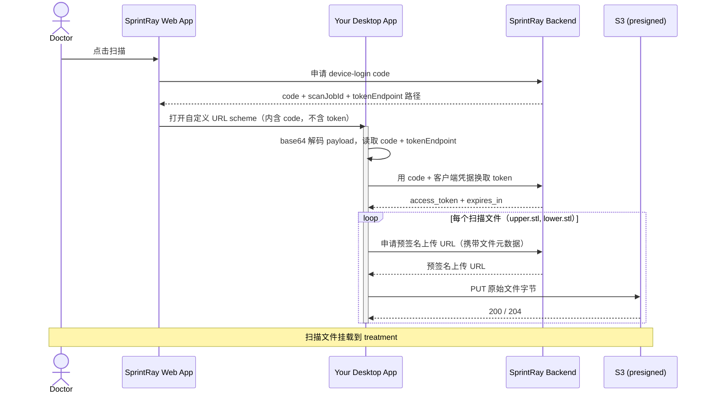

# SprintRay 桌面扫描仪集成 — 示例应用

[English](./README.md) | 中文

一个**桌面应用侧**的参考实现与命令行**示例应用**,对应 SprintRay 的 device-login + 扫描文件上传集成。
用它理解整个流程,并在把逻辑接入你真实的桌面扫描仪应用之前完成端到端联调。

零依赖 —— 仅使用 Node.js ≥ 18 内置能力。

## 集成流程

从你的桌面应用视角,共四步 —— **无浏览器、无需重新登录,且 token 绝不出现在启动 URL 中**:

1. **拉起。** 在 treatment 页面,SprintRay Web 端通过你注册的自定义 URL scheme 拉起你的应用,
   并带上一段 base64 编码的 JSON —— `yourscheme://<base64_json>` —— 其中只含一个**一次性、短时效的 `code`**。
2. **解码。** 对 payload 做 base64 解码,读取 `code`、token 接口路径,以及 treatment / case 标识
   (见[启动 payload](#启动-payload))。
3. **换取 token。** 通过 HTTPS 把 `code` + 你的客户端凭据 POST 上去,换取已登录医生的 `access_token`。
4. **上传。** 对每个扫描文件,先申请预签名上传 URL,再把文件字节 PUT 上去。扫描文件会自动挂到 treatment 上。

### 流程



### 启动 payload

```json
{
  "caller": { "name": "SprintRay", "version": "1.0.10.0" },
  "case": { "name": "<患者姓名>", "ID": "<scan-job id>" },
  "treatment": {
    "teeth": [
      { "teeth": 3, "notes": "", "toothApplianceType": 3, "groupNumber": null }
    ]
  },
  "fileType": null,
  "language": "en_US",
  "serverType": 0,
  "toothSystem": "fdi",
  "auth": {
    "code": "<one-time-code>",
    "tokenEndpoint": "/api/integration/device-login-token",
    "expiresIn": 600
  },
  "treatmentId": "<treatment id>",
  "externalCaseId": "<external case id>"
}
```

| 字段 | 用途 |
|---|---|
| `caller` | 拉起方(`SprintRay` + Web 端版本) |
| `case.name` | 患者显示名 |
| `case.ID` | 本次拉起的 scan-job 标识 |
| `treatment.teeth[]` | 选中的牙位 —— `teeth`(牙号)、`notes`、`toothApplianceType`、`groupNumber` |
| `fileType` | 请求的文件类型(`TreatmentFiles`;见 [枚举](#枚举)),整口扫描时为 `null` |
| `language` | 界面语言,如 `en_US` |
| `serverType` | 服务器类型标识 |
| `toothSystem` | 牙位编号系统:`fdi` 或 `utn` |
| `auth.code` | 用于换取 token 的一次性 device-login code |
| `auth.tokenEndpoint` | token 接口**路径** —— 拼接到后端 origin 之后 |
| `auth.expiresIn` | code 有效期(秒) |
| `treatmentId` | 上传的扫描文件要挂载到的 treatment |
| `externalCaseId` | 外部 case id(上传时作为 `externalCaseId` 传回) |

> `auth`、`treatmentId`、`externalCaseId` 是 SprintRay 的静默鉴权与上传上下文;
> 其余为标准 ScanPro 启动 payload。

## 接口约定

共两个调用。`{ORIGIN}` 为对应环境下固定的 SprintRay 后端 origin(不带 `/api` 后缀,路径本身已含 `/api`):

| 环境 | `{ORIGIN}` |
|---|---|
| dev | `https://dashboard.sprintray.com` |
| staging | `https://dashboard.sprintray.com` |
| prod | `https://dashboard.sprintray.com` |

### 1. 用 code 换取 token

```http
POST {ORIGIN}{auth.tokenEndpoint}
Content-Type: application/json

{ "code": "<code>", "clientId": "<your-client-id>", "clientSecret": "<your-client-secret>" }
```

`200 → { "access_token": "…", "token_type": "Bearer", "expires_in": 86400 }`

错误:`400` code 缺失/过期/已使用 · `401` 客户端凭据错误。token 过期后,重新拉起以获取新 token。

### 2. 申请预签名上传 URL,再 PUT 文件

```http
POST {ORIGIN}/api/file/upload
Authorization: Bearer <access_token>
Content-Type: application/json

{ "fileName": "upper.stl", "fileSize": 3083734, "treatmentId": "<treatment-id>",
  "treatmentFileType": 1, "externalCaseId": "<external-case-id>" }
```

`200 →` 一个预签名上传 URL(JSON 字符串,或 `{ "url": "…" }`)

```http
PUT <presignedUrl>
Content-Type: application/octet-stream
Content-Length: <fileSize>

<原始文件字节>
```

成功返回 `200`/`204`。PUT 请求**不带**鉴权头 —— 预签名 URL 自带授权。

- `treatmentFileType`:**`1` = 上颌,`2` = 下颌**。示例应用优先使用启动 payload 中的 `fileType`,
  没有时回退到各文件的默认值(upper.stl → `1`,lower.stl → `2`)。每次上传都会在日志中打印所用的
  取值及其来源。
- 扫描文件为 **STL** 格式。

## 枚举

payload 与上传调用中用到的数值枚举。

### `treatmentFileType` / `fileType` —— `TreatmentFiles`

上传时作为 `treatmentFileType` 发送,在启动 payload 中作为 `fileType` 收到。口内扫描只需:

| 值 | 名称 |
|---|---|
| `1` | UpperJaw(上颌) |
| `2` | LowerJaw(下颌) |

<details>
<summary>全部 <code>TreatmentFiles</code> 取值</summary>

| 值 | 名称 |
|---|---|
| 1 | UpperJaw |
| 2 | LowerJaw |
| 3 | LeftSide |
| 4 | RightSide |
| 5 | Other |
| 6 | Spr |
| 7 | SingleStl |
| 8 | DesignPhoto |
| 9 | CBCT |
| 10 | SingleStlWithSupports |
| 11 | BaseStl |
| 12 | BaseSpr |
| 13 | PonticStl |
| 14 | PonticSpr |
| 15 | PatientPhoto |
| 16 | SurgicalGuideStl |
| 17 | SurgicalGuideSpr |
| 18 | CementedRestorationStl |
| 19 | CementedRestorationSpr |
| 20 | RemovableDieStl |
| 21 | RemovableDieSpr |
| 22 | CustomBleachingTrayStl |
| 23 | CustomBleachingTraySpr |
| 24 | WaxUpUpperStl |
| 25 | TrialSmileUpperStl |
| 26 | WaxUpSpr |
| 27 | TrialSmileSpr |
| 28 | DesignVideo |
| 29 | MonolithicTryInDentureStl |
| 30 | MonolithicTryInDentureSpr |
| 31 | DentureGumBaseStl |
| 32 | DentureGumBaseSpr |
| 33 | DentureTeethStl |
| 34 | DentureTeethSpr |
| 35 | WaxUpLowerStl |
| 36 | TrialSmileLowerStl |
| 37 | CephXRayPhoto |
| 38 | PanoXRayPhoto |
| 39 | FrontFace |
| 40 | FrontSmile |
| 41 | RightSideFace |
| 42 | LeftSideFace |
| 43 | FrontTeeth |
| 44 | RightSideTeeth |
| 45 | LeftSideTeeth |
| 46 | UpperJawImage |
| 47 | LowerJawImage |
| 48 | PreppedToothIntraoralScans |
| 49 | DentureWaxSetup |
| 50 | UpperTissueScan |
| 51 | LowerTissueScan |
| 52 | PhotogrammetryData |
| 53 | MonolithicHybridDenturesStl |
| 54 | MonolithicHybridDenturesSpr |
| 55 | AICrownPreviewImage |
| 56 | AICrownStl |
| 57 | AICrownDieStl |
| 58 | BiteScanCombo |
| 59 | DentureUpperStl |
| 60 | DentureLowerStl |
| 61 | SmileDesignStl |
| 63 | SmileDesignFrontSmile |
| 64 | UpperJawRetainer |
| 65 | LowerJawRetainer |
| 66 | UpperJawAligner |
| 67 | LowerJawAligner |
| 68 | SprRetainer |
| 69 | SprAligner |
| 70 | UpperAppliance |
| 71 | LowerAppliance |
| 72 | UpperAntagonist |
| 73 | LowerAntagonist |
| 74 | VeneersDesignFrontSmile |
| 75 | VeneersStl |
| 76 | VeneersSpr |
| 77 | PreppedUpperJaw |
| 78 | PreppedLowerJaw |
| 79 | DentalModelDieStl |
| 80 | Link |
| 81 | ImplantCrownStl |
| 82 | ImplantShellTempStl |
| 83 | ImplantBridgeStl |
| 84 | UpperDirectPrintAppliance |
| 85 | LowerDirectPrintAppliance |
| 86 | UpperDirectPrintTemplate |
| 87 | LowerDirectPrintTemplate |
| 88 | SingleStlOnlyView |
| 89 | UpperJawOnlyViewStl |
| 90 | LowerJawOnlyViewStl |
| 91 | TrackingLink |
| 92 | PartialDentureBaseStl |
| 93 | PartialDentureBaseSpr |
| 94 | TreatmentTeethImage |
| 95 | AISmilePreviewImage |
| 96 | AISmilePreviewVideo |
| 97 | PreOpUpperJaw |
| 98 | PreOpLowerJaw |
| 99 | CorrectedUpperJaw |
| 100 | CorrectedLowerJaw |
| 101 | Profile45Degree |
| 102 | UpperScanbodyScan |
| 103 | LowerScanbodyScan |

`62` 未使用。

</details>

### `treatment.teeth[].toothApplianceType` —— `ToothApplianceType`

| 值 | 名称 |
|---|---|
| 1 | PonticSites |
| 2 | Clasps |
| 3 | Crown |
| 4 | SplintCrown |
| 5 | Splint |
| 6 | Inlay |
| 7 | Onlay |
| 8 | ShellTemp |
| 9 | Wings |
| 10 | Base |
| 11 | Extraction |

### `toothSystem`

由医生的牙位编号偏好(`DentalNotation`)映射而来的字符串:

| `toothSystem` | 含义 |
|---|---|
| `utn` | 通用牙位编号 Universal Tooth Numbering(`DentalNotation.Utn` = 1)—— 默认 |
| `fdi` | FDI 世界牙科联盟编号(`DentalNotation.Fdi` = 2) |

### `serverType`

目前没有为其定义枚举,始终为固定值 `0`。

## 你需要向 SprintRay 索取的信息

| 值 | 环境变量 | 说明 |
|---|---|---|
| 后端 origin | `SCANPRO_BASE_URL` | 按环境固定(dev / staging / prod,见上表);不带 `/api` 后缀 |
| Client ID | `SCANPRO_CLIENT_ID` | 你集成的公开 id |
| Client Secret | `SCANPRO_CLIENT_SECRET` | 仅保存在服务端 / 你的应用内 |
| URL scheme | `SCANPRO_URL_SCHEME` | 你的应用注册的 scheme,如 `openScanPro` |

## 运行示例应用

前置条件:Node.js ≥ 18(`--env-file` 需 ≥ 20.6)。支持 macOS / Windows / Linux(scheme 注册以 macOS 为已验证路径)。

```sh
cp .env.example .env      # 填入 origin、client id/secret、scheme
```

### 注册 URL scheme(真实的系统拉起)

让操作系统把 `yourscheme://…` 路由到本示例应用,这样在浏览器里点击拉起入口即可真实启动它:

```sh
npm run register      # 向操作系统注册 scheme
npm run status        # 查看该 scheme 当前解析到哪里
npm run unregister    # 移除
```

- **macOS**:会在 `~/Applications` 下创建一个 app;首次拉起会请求"控制 Terminal"(用于展示运行过程)
  —— 点 **OK**,或用 `npm run register -- --headless` 改为输出到日志文件。改动代码或 `.env` 后需重新 `register`。
- **Windows / Linux**:注册为当前用户级处理器(注册表 / `.desktop`)。

### 直接对启动 URL 运行

```sh
# 形式 A —— 浏览器交过来的深链
node --env-file=.env src/index.js "yourscheme://<base64_json>"

# 形式 B —— 显式传入 code(无启动 URL)
node --env-file=.env src/index.js --code <code> --base-url <origin> --treatment-id <guid>
```

追加 `--demo-refresh` 可一并演示 token 刷新接口。

### 它做了什么

每次运行会:换取 token,然后上传 `fixtures/upper.stl` 与 `fixtures/lower.stl`,并展示实时进度条。
**每个后端请求与响应都会被完整打印**(方法、URL、请求头、请求体 / 状态码、响应头、响应体),
让你清楚地看到该发送什么、该期望什么。把 `fixtures/` 里的两个文件替换成你自己的扫描件即可测试其它数据。

## 退出码

- `0` —— 换取 token 且全部上传成功(或 register/status/unregister 命令完成)
- `1` —— 参数错误、缺少环境变量,或换取 token / 上传失败
